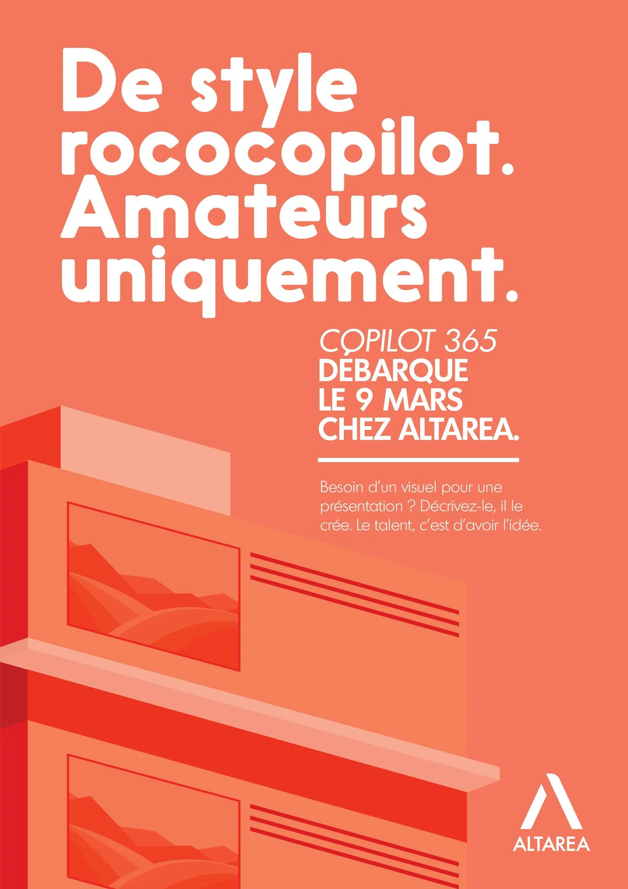
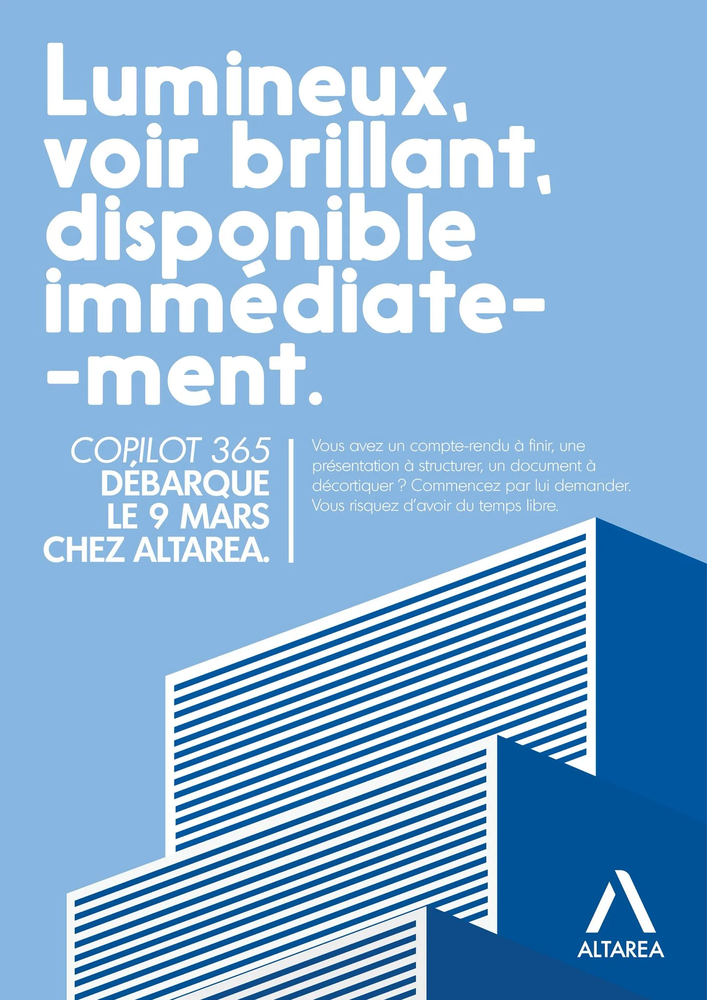
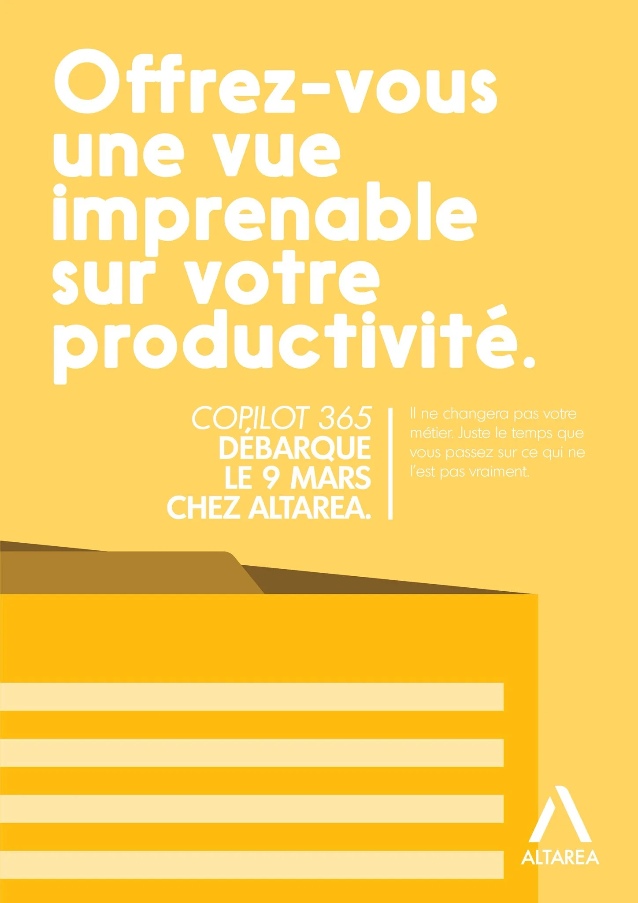
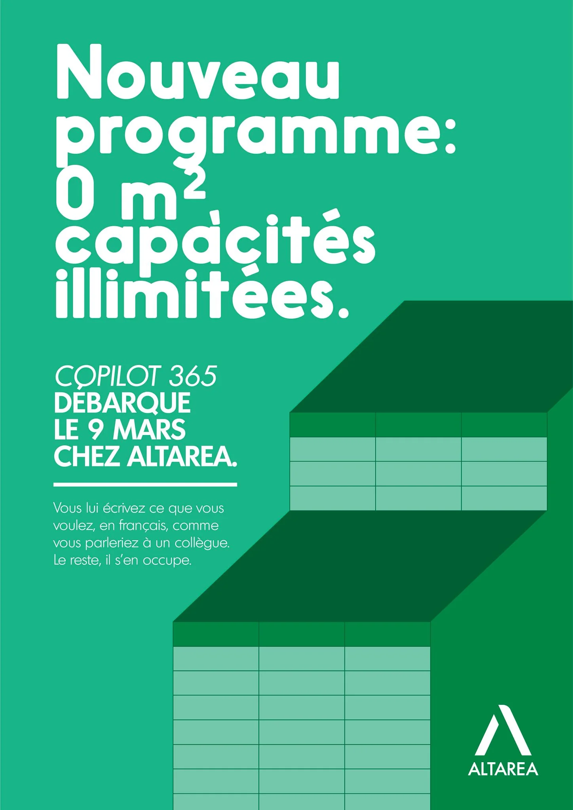
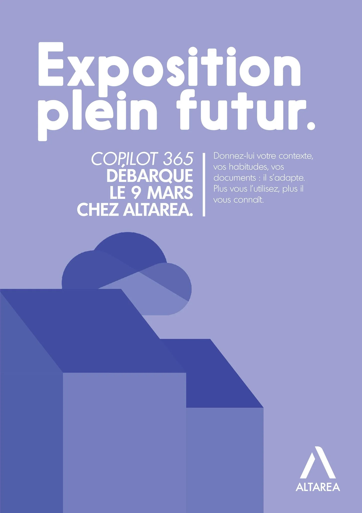

# Altarea - IA Générative

| Clé | Valeur |
|-----|--------|
| **Client** | Altarea |
| **Année** | 2026 |
| **Sujet** | IA Générative (déploiement Copilot 365) |
| **Rôle** | Conception, rédaction, direction artistique |
| **Tags** | Communication interne, IA générative, Conduite du changement |
| **Canal** | OXGEN |

## Contexte

Altarea, leader de la transformation urbaine en France (promotion immobilière, commerce, logistique), déploie Copilot 365 pour l'ensemble de ses collaborateurs. La culture interne n'est pas tech-first : les métiers vont du développement foncier à la gestion d'actifs, en passant par le commerce et le juridique. Le brief est clair : créer l'envie plutôt que la peur, dédramatiser l'IA générative sans la banaliser, et ancrer le message dans l'ADN métier du Groupe.

## Approche

Détourner le vocabulaire immobilier d'Altarea pour décrire un outil IA. "Lumineux, voir brillant, disponible immédiatement." "Offrez-vous une vue imprenable sur votre productivité." "De style rococopilot. Amateurs uniquement." Chaque affiche a sa couleur propre (corail, bleu, jaune doré) et son illustration architecturale géométrique qui ancre le lien visuel avec le métier du Groupe. Le jargon tech disparaît, remplacé par le langage des petites annonces immobilières.

## Livrables

- Concept vocabulaire immo appliqué IA
- 3 affiches lancement corail, bleu, doré
- Illustrations architecturales sur mesure
- Teasing pré-lancement et Town Hall
- Guidelines de ton communication IA

## Punchline

> Quand Copilot se vend comme un appartement lumineux avec vue imprenable, même les non-techs veulent visiter.

## Visuels

## Liens

- [experience/oxgen.md](../experience/oxgen.md)
- [projects/altaria.md](./altaria.md)
