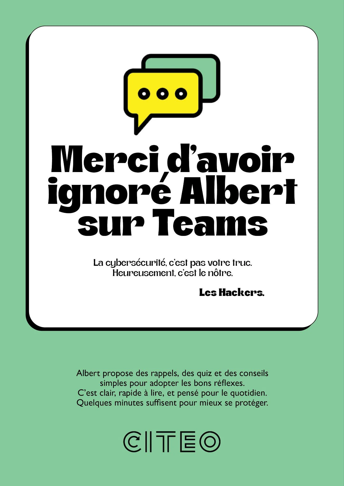
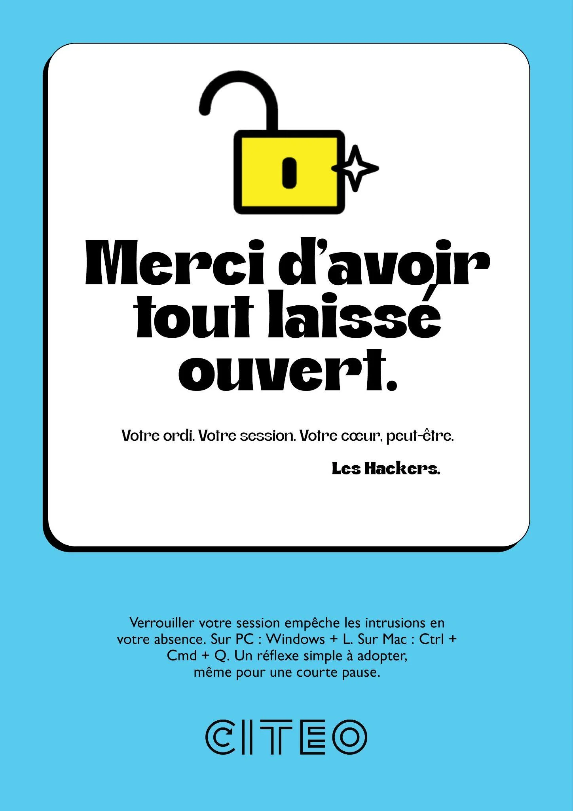
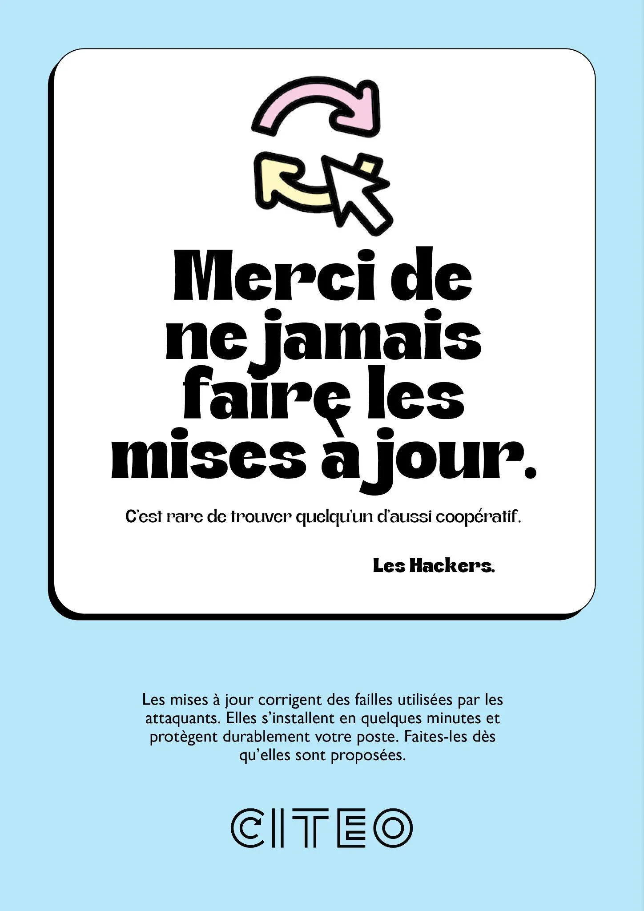
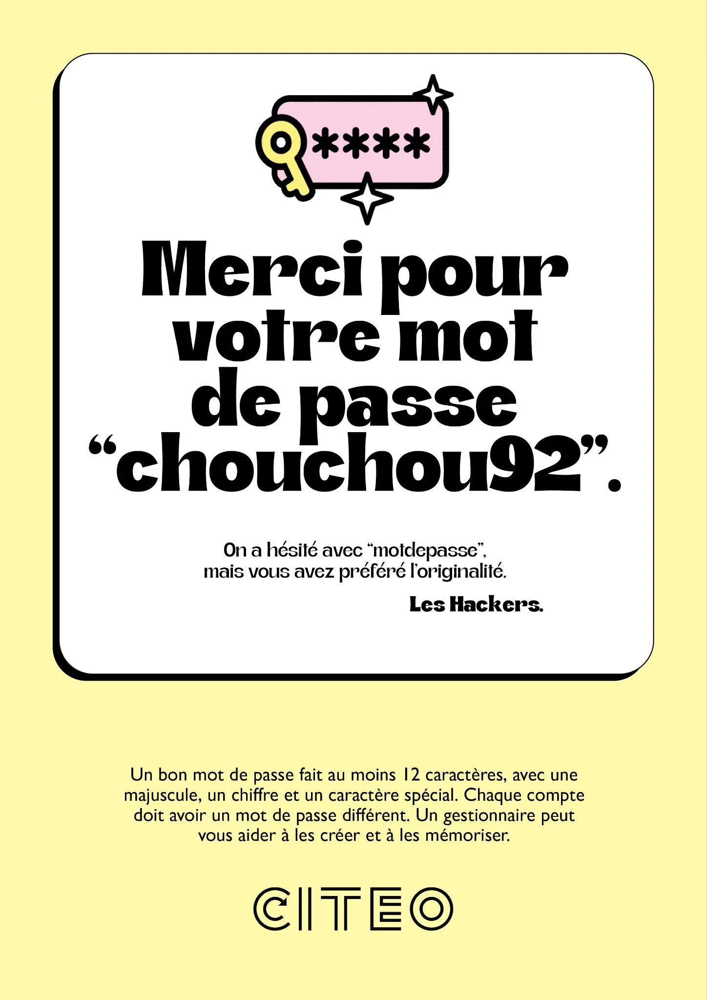
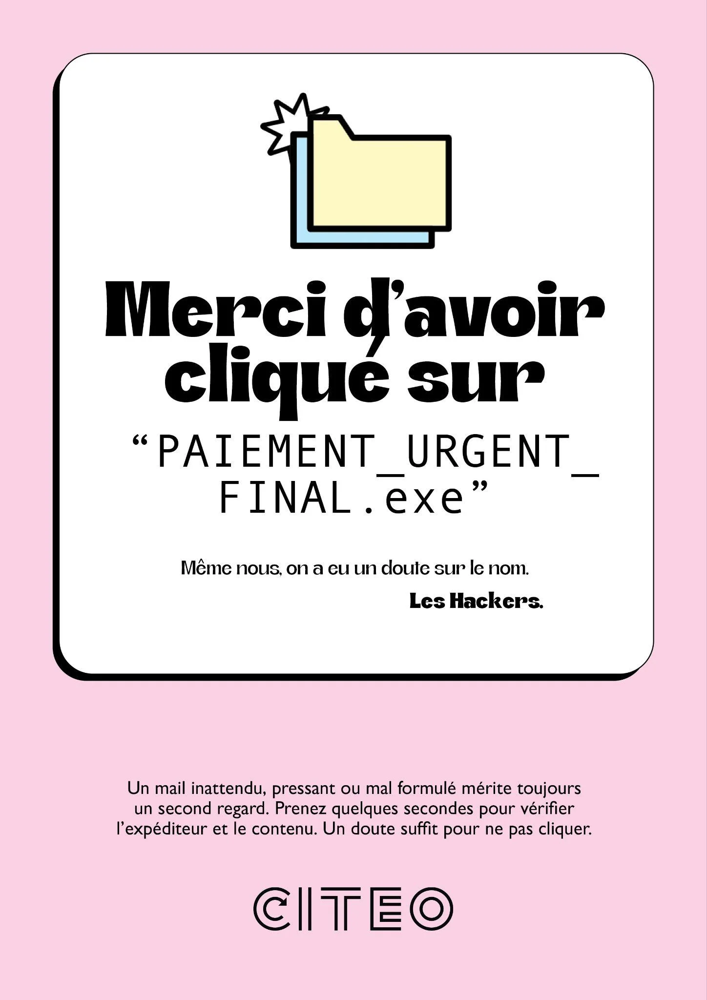
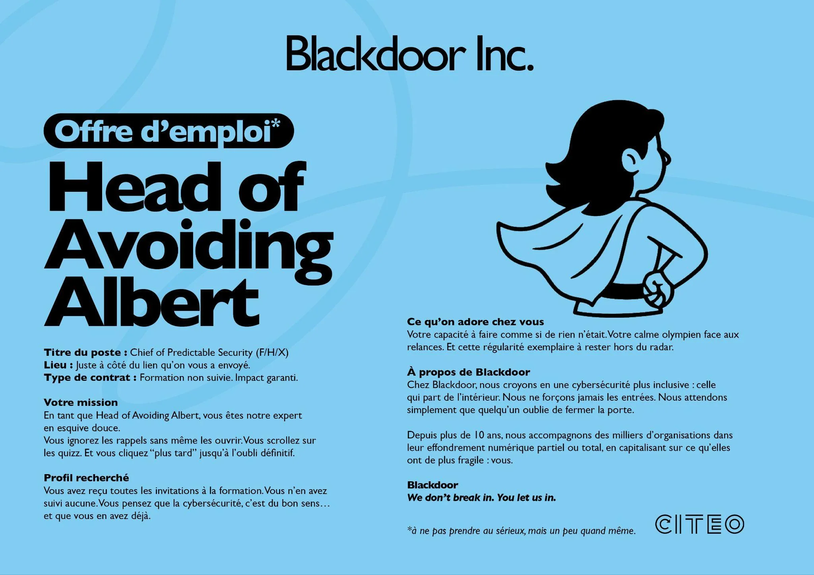
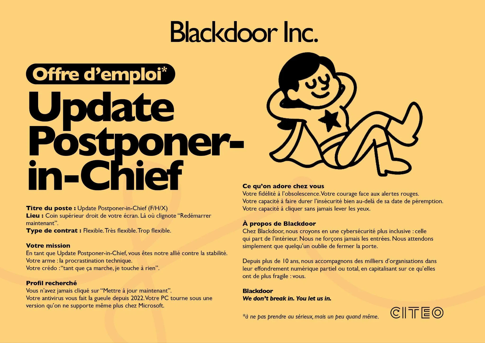
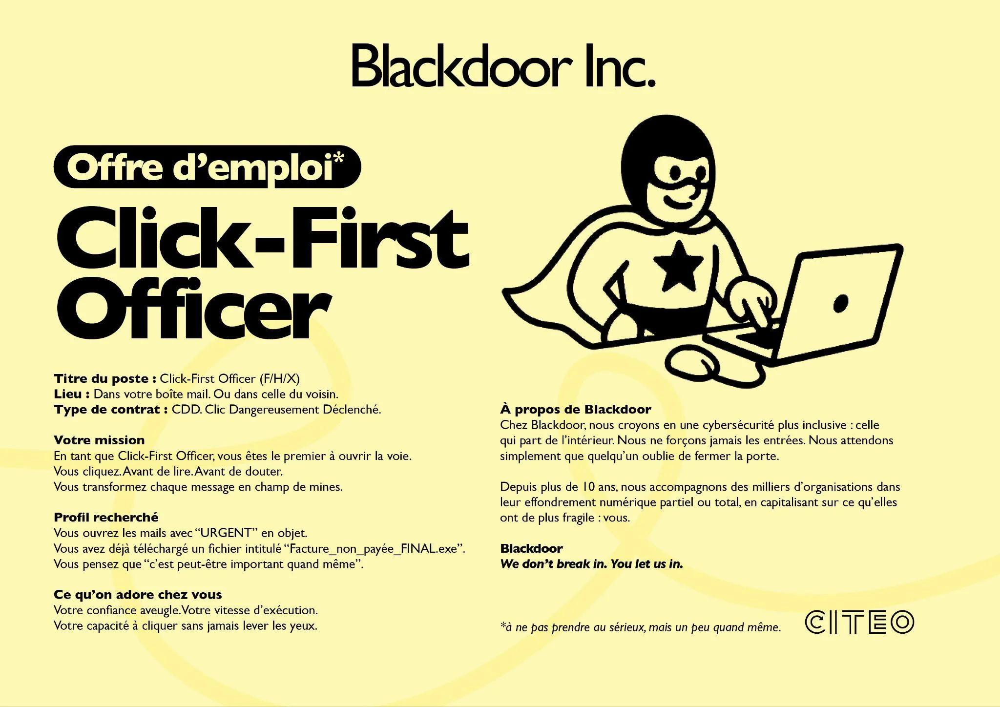
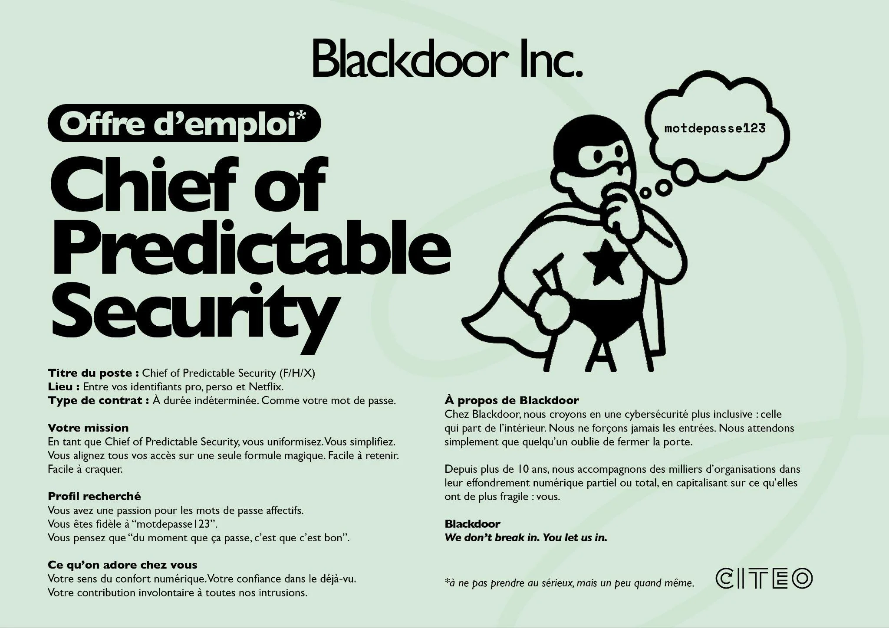
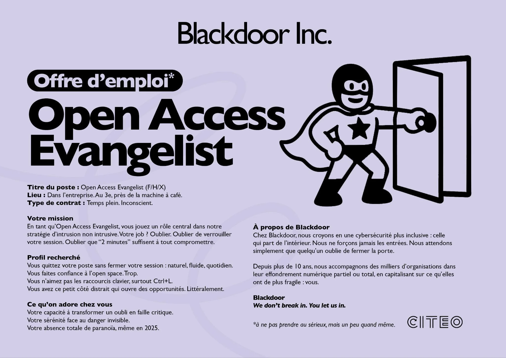

# Citeo - Cybersécurité (Les Hackers)

| Clé | Valeur |
|-----|--------|
| **Client** | Citeo |
| **Année** | 2025 |
| **Sujet** | Cybersécurité |
| **Rôle** | Conception, rédaction, direction artistique |
| **Tags** | Communication interne, Cybersécurité, Guérilla marketing |
| **Canal** | OXGEN |
| **KPI** | Score résilience phishing 6/10 -> 7/10 |

## Contexte

Citeo, éco-organisme français en charge du recyclage des emballages et papiers (financé par 30 000+ entreprises), doit faire passer son score de résilience phishing de 6/10 à 7/10. Contraintes : budget serré, COMEX pas encore embarqué sur la cyber, et ~250 collaborateurs multi-sites déjà exposés aux messages génériques "ne cliquez pas sur les liens suspects". Le brief exige un concept suffisamment percutant pour fonctionner sur les murs sans budget média.

## Approche

Concept "Les Hackers" : chaque affiche est signée par les hackers eux-mêmes, qui remercient les collaborateurs pour leurs mauvaises habitudes. "Merci d'avoir ignoré Albert sur Teams." "Merci d'avoir tout laissé ouvert. Votre ordi. Votre session. Votre coeur, peut-être." "Merci de ne jamais faire les mises à jour." Le sarcasme capte l'attention, le conseil pratique suit en dessous. DA : fonds pastels, carte blanche avec icône custom, typo serif bold éditoriale.

## Livrables

- Concept de campagne "Les Hackers"
- 5 affiches signées par les hackers
- Stickers et signalétique guérilla
- Déclinaisons écrans multi-sites
- Guidelines de ton cyber

## Punchline

> Quand ce sont les hackers eux-mêmes qui écrivent la com interne, personne ne scrolle.

## Visuels

## Liens

- [experience/oxgen.md](../experience/oxgen.md)
