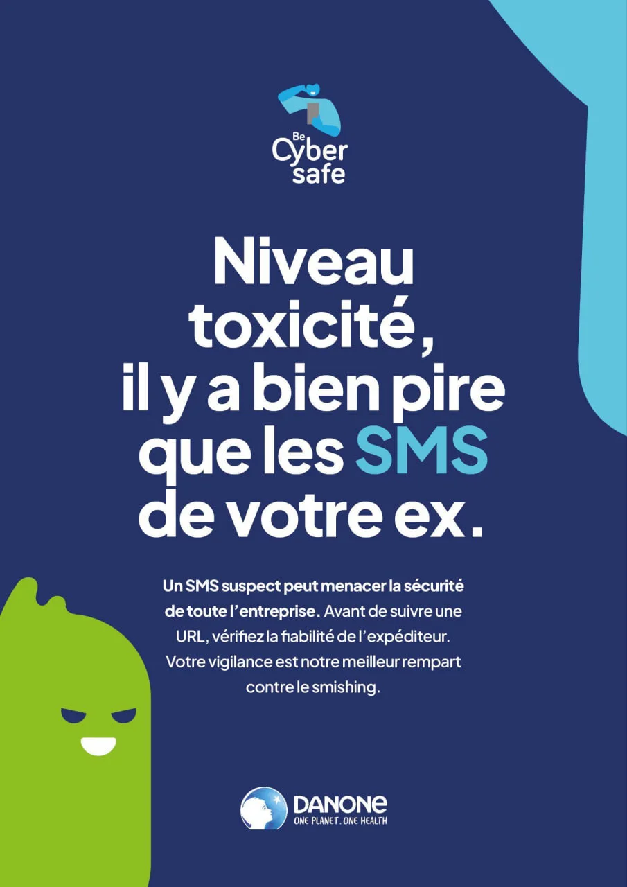
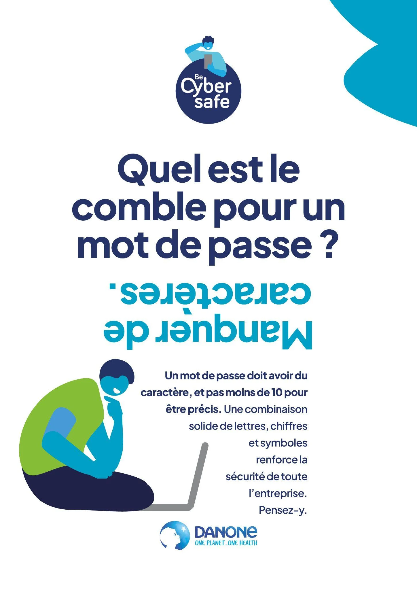
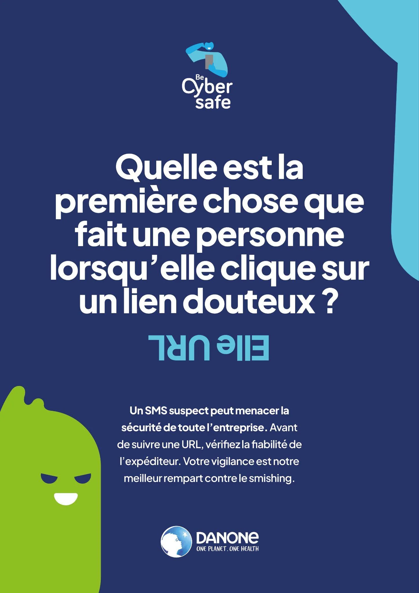
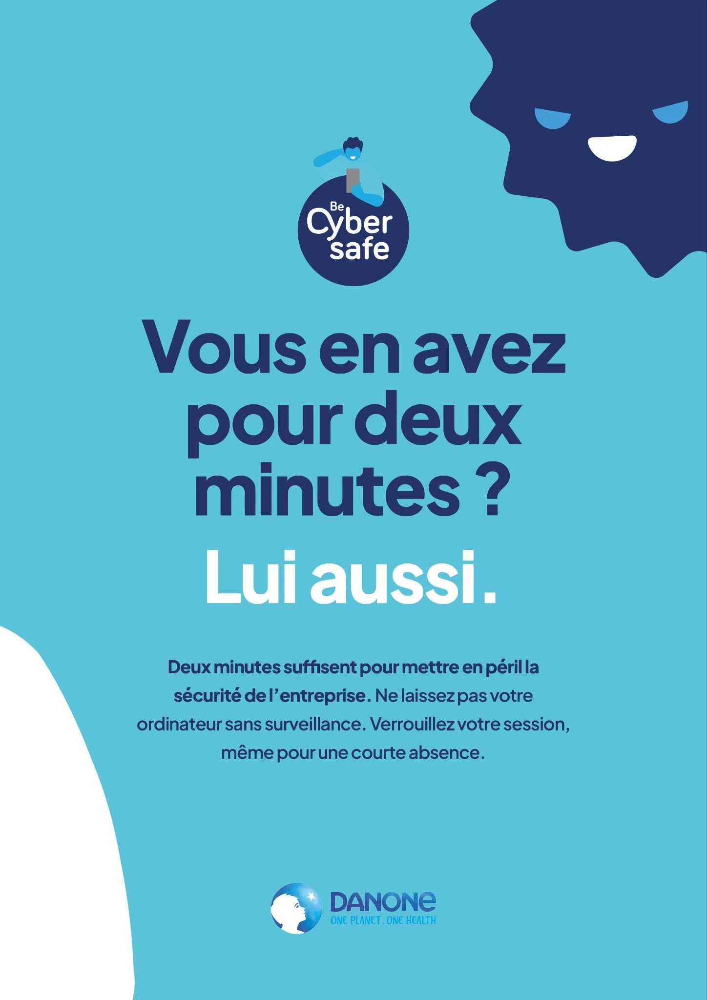
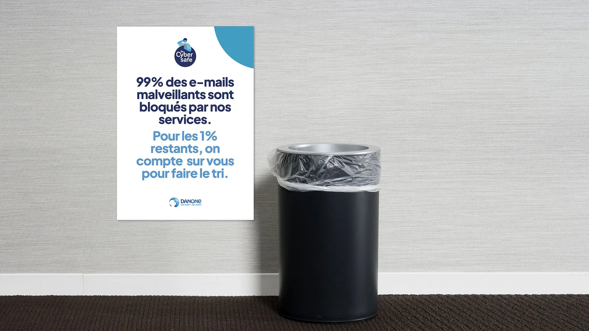

# Danone - Cybermoi/s

| Clé | Valeur |
|-----|--------|
| **Client** | Danone |
| **Année** | 2023 |
| **Sujet** | Cybermoi/s |
| **Rôle** | Conception, rédaction, direction artistique |
| **Tags** | Communication interne, Cybersécurité, Sensibilisation |
| **Canal** | OXGEN |
| **Portée** | 100 000+ collaborateurs, 55 pays, bilingue FR/EN |

## Contexte

Danone (100 000+ collaborateurs, 55 pays) veut marquer les esprits pour le Cybermoi/s européen et relancer la vigilance face au phishing et aux mots de passe faibles. Les campagnes cyber précédentes suivaient le ton institutionnel : sérieux, technique, ignoré par la majorité. Le brief exige un registre radicalement décalé pour capter l'attention dans un environnement saturé de com corporate, avec un déploiement bilingue FR/EN sur Workplace et Viva Engage à l'échelle mondiale.

## Approche

Affiches au format devinette avec réponse imprimée à l'envers pour forcer l'interaction physique : le lecteur doit retourner l'affiche pour découvrir la chute. Jeux de mots bilingues ("Quel est le comble pour un mot de passe ? Manquer de caractères.", "Elle URL"). Illustrations custom et identité visuelle "Be Cyber Safe" déclinée sur tous les supports. Ton décalé et autodérision rare en com interne corporate. Guérilla imprimantes, cafétéria, open spaces et écrans de veille.

## Livrables

- Affiches devinette réponse à l'envers
- Identité et visuels "Be Cyber Safe"
- Posts Viva Engage bilingues FR/EN
- Guérilla cafétéria et open spaces
- Emailing de sensibilisation

## Punchline

> La réponse est à l'envers : les gens tournent l'affiche. Une interaction de plus que toute la com cyber de l'année.

## Visuels

## Liens

- [experience/oxgen.md](../experience/oxgen.md)
