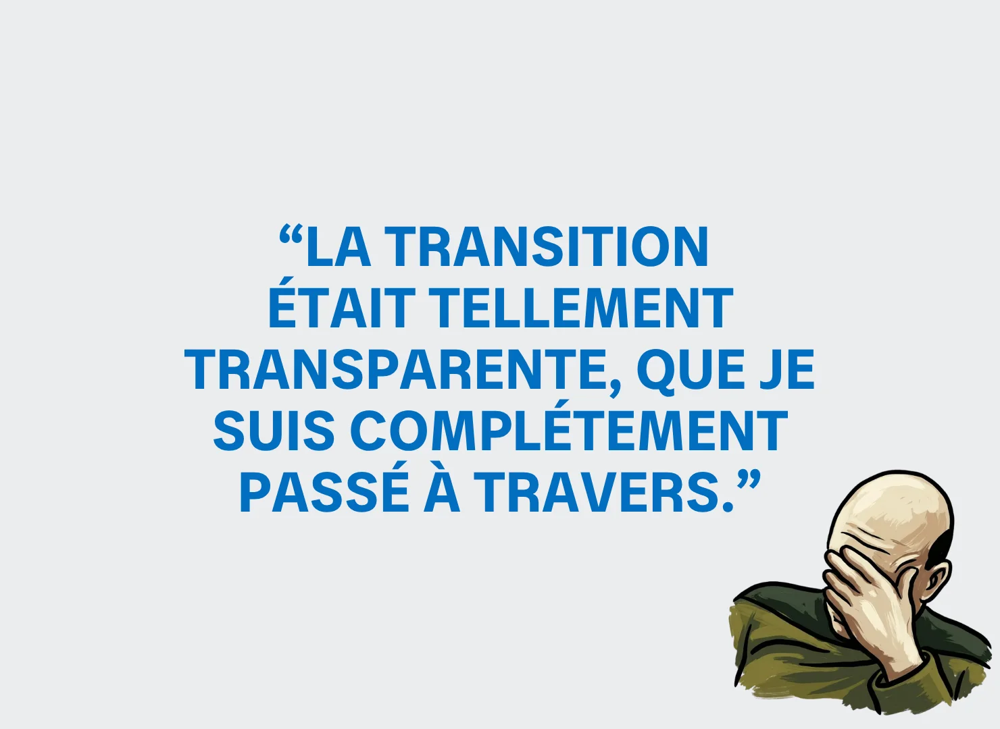
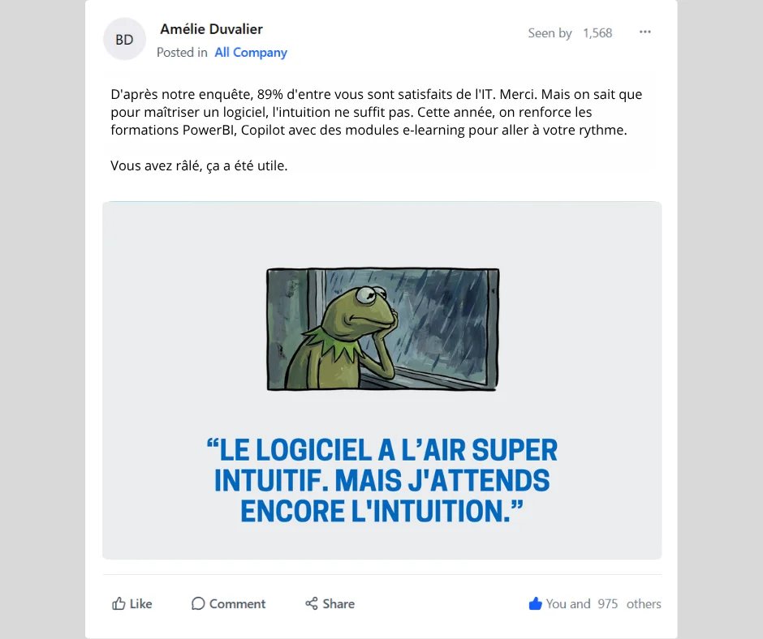
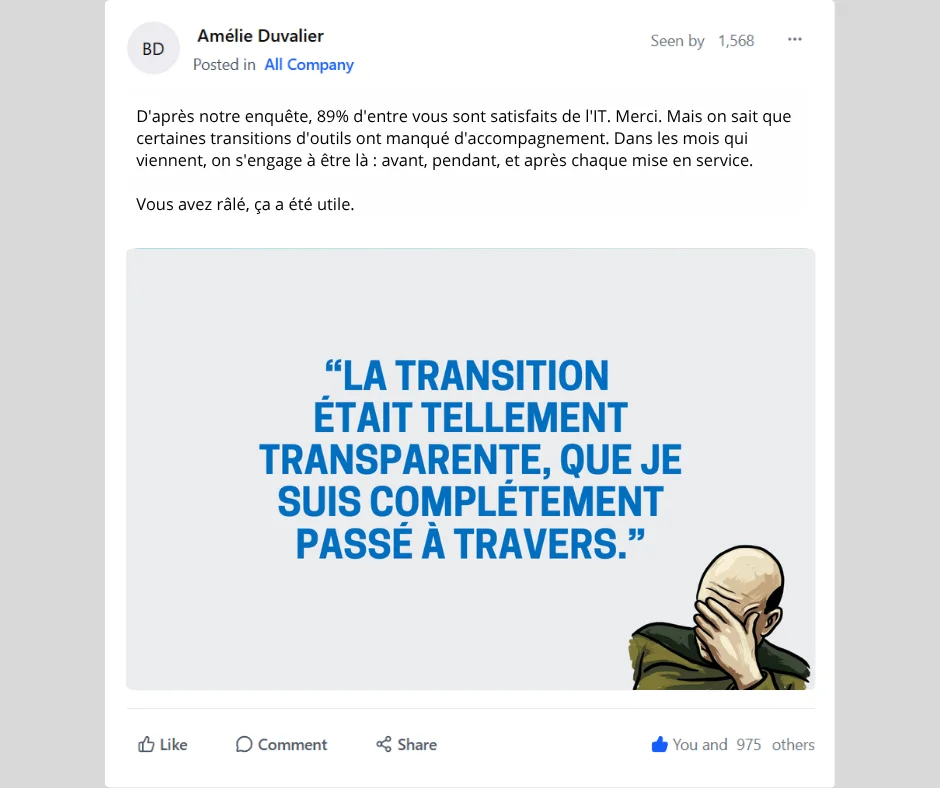

# Danone - IT Survey

| Clé | Valeur |
|-----|--------|
| **Client** | Danone |
| **Année** | 2026 |
| **Sujet** | IT Survey |
| **Rôle** | Conception, rédaction, direction artistique |
| **Tags** | Communication interne, Engagement, Mèmes |
| **Canal** | OXGEN |
| **Portée** | 100 000+ collaborateurs, 50+ pays, bilingue FR/EN |

## Contexte

Chaque année, la DSI Danone lance son sondage global de satisfaction IT auprès de 100 000+ collaborateurs. Le problème : un taux de participation historiquement faible, en baisse constante. Les collaborateurs voient ça comme une corvée corporate de plus, sans retombée visible. Les campagnes précédentes misaient sur le ton institutionnel ("Votre avis compte !") que tout le monde scrolle. Le brief : casser les codes pour donner envie de répondre, dans 50+ pays et en bilingue FR/EN.

## Approche

Détournement de mèmes internet cultes (Kermit à la fenêtre, le chien dans l'incendie, le chat perplexe) avec des verbatims IT frustrés pour créer l'identification immédiate. "Mon VPN un lundi matin." "Quand la visio freeze pile au moment où tu parles." Séquence d'emailings avec absurdité croissante pour relancer les non-répondants semaine après semaine. Ton inédit en com interne corporate : humour brut et autodérision, décliné en bilingue FR/EN sur Viva Engage et Workplace.

## Livrables

- Série de mèmes IT pour réseaux internes
- Posts bilingues FR/EN humour localisé
- Emailings relance absurdité croissante
- Kit managers contenus prêts à poster
- Visuels Workplace et Viva Engage

## Punchline

> La com interne passe de "merci de remplir le sondage" à "votre VPN un lundi matin". La participation suit.

## Visuels

## Liens

- [experience/oxgen.md](../experience/oxgen.md)
- [projects/case-danone-cyber.md](./case-danone-cyber.md)
