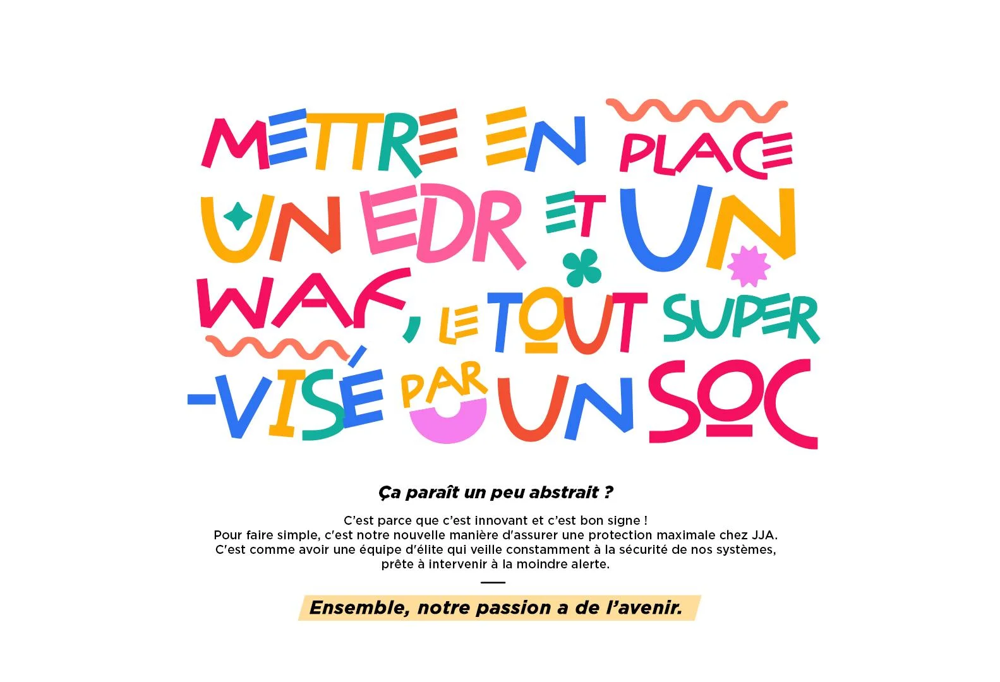
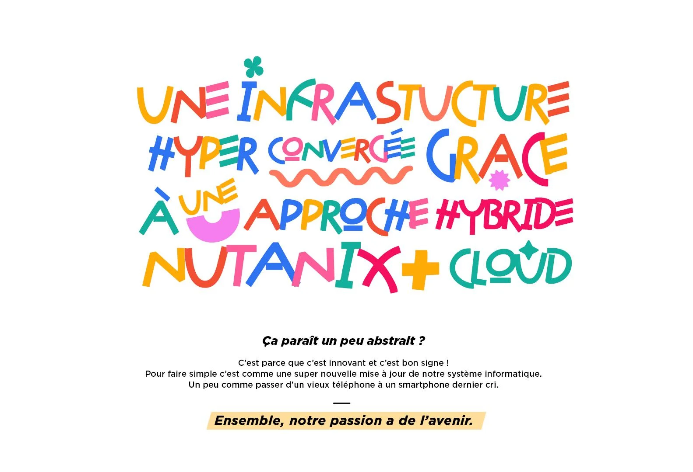
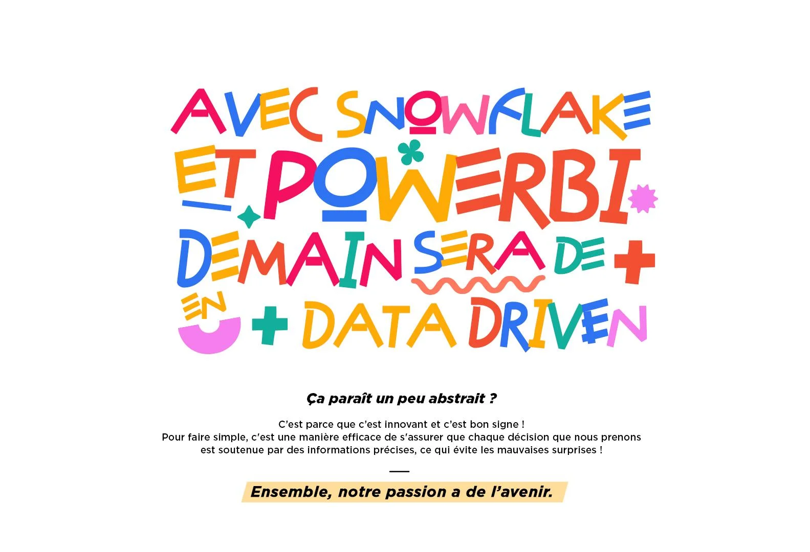
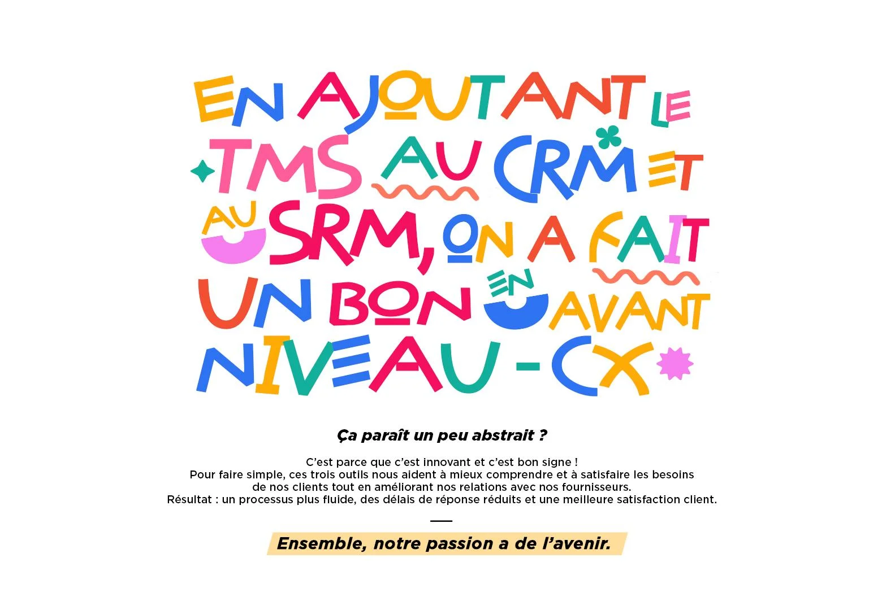
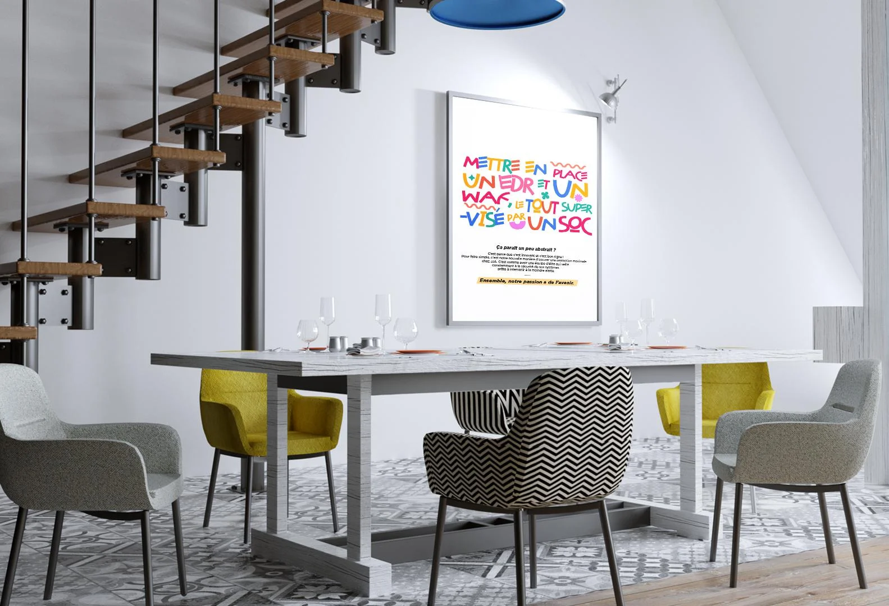

# JJA - Transformation DSI

| Clé | Valeur |
|-----|--------|
| **Client** | JJA |
| **Année** | 2023 |
| **Sujet** | Transformation DSI |
| **Rôle** | Conception, rédaction, direction artistique |
| **Tags** | Communication interne, Transformation DSI, Innovation |
| **Canal** | OXGEN |

## Contexte

JJA, groupe français de distribution d'accessoires pour la maison (1 200 collaborateurs, 3 milliards de produits/an), a mené une transformation DSI en 3 ans : cybersécurité (EDR, WAF, SOC), migration data (Snowflake, PowerBI), modernisation infrastructure (Nutanix). En dehors de l'IT, personne ne mesure l'ampleur du travail accompli. Double enjeu : rendre fières les équipes techniques et démontrer la valeur créée aux métiers qui n'y voient que des acronymes.

## Approche

Prendre le jargon IT le plus intimidant (EDR, WAF, SOC, Nutanix, Snowflake, PowerBI) et l'écrire en typo multicolore façon dessin d'enfant sur fond blanc. Le contraste entre la complexité technique et l'esthétique naïve crée l'arrêt visuel immédiat. "Ça paraît un peu abstrait ?" sert de pont vers une explication limpide en langage courant, accessible à tous les métiers. DA sobre et ludique, palette vive par projet DSI. Tagline fédératrice : "Ensemble, notre passion a de l'avenir."

## Livrables

- Concept typo enfantine / jargon tech
- Visuels par projet DSI (cyber, data)
- Communication double cible DSI + métiers
- Assets présentation comité direction
- Déclinaisons intranet et événementiel

## Punchline

> Quand EDR, WAF et SOC deviennent des gribouillages multicolores, même le COMEX arrête de scroller.

## Visuels

## Liens

- [experience/oxgen.md](../experience/oxgen.md)
