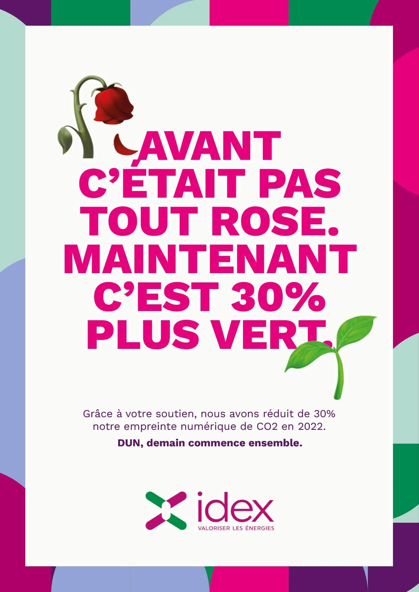
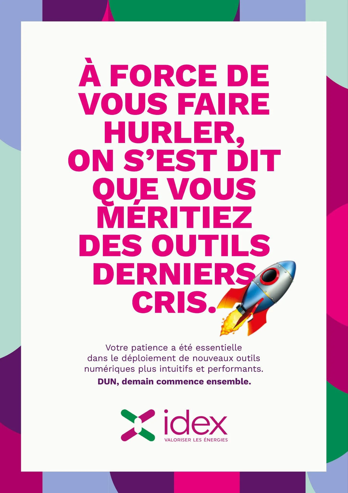
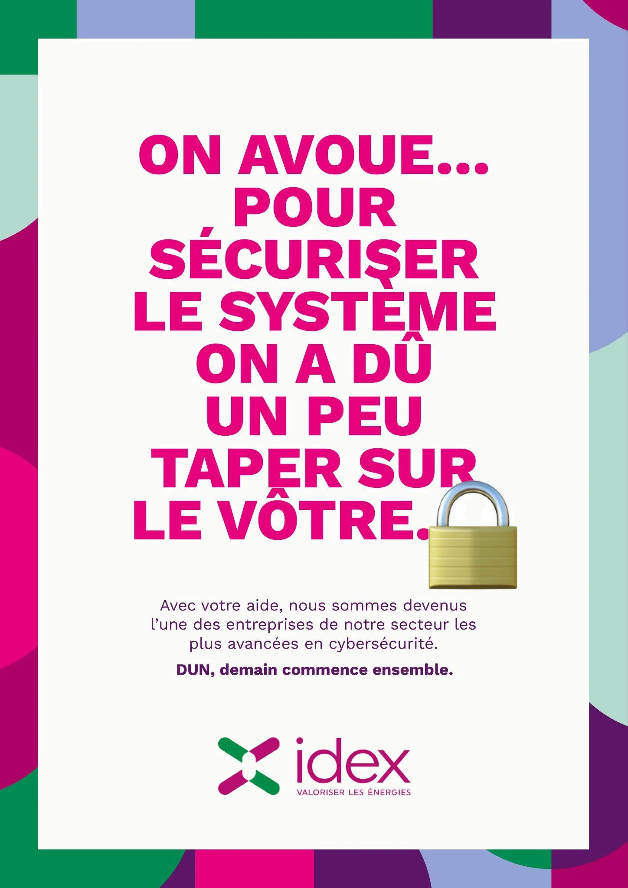
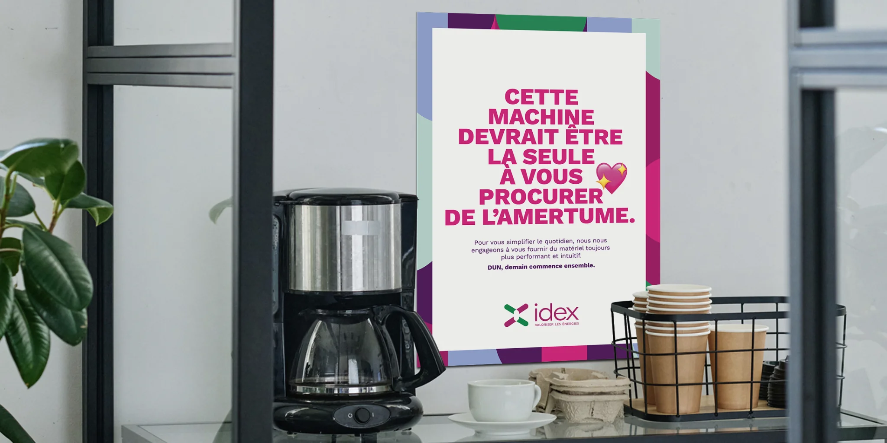
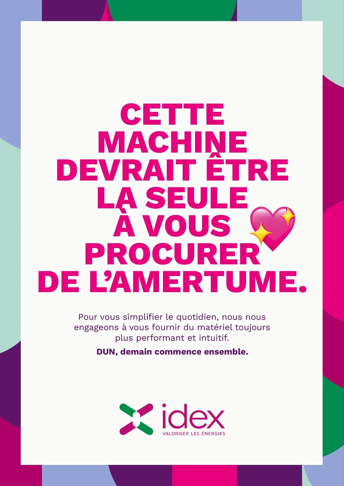
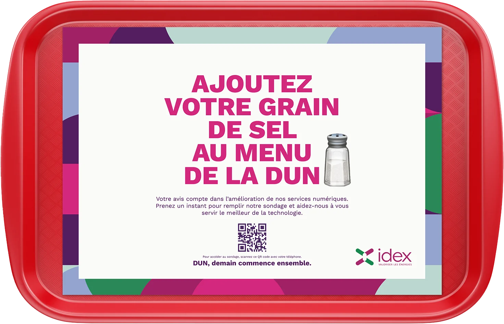
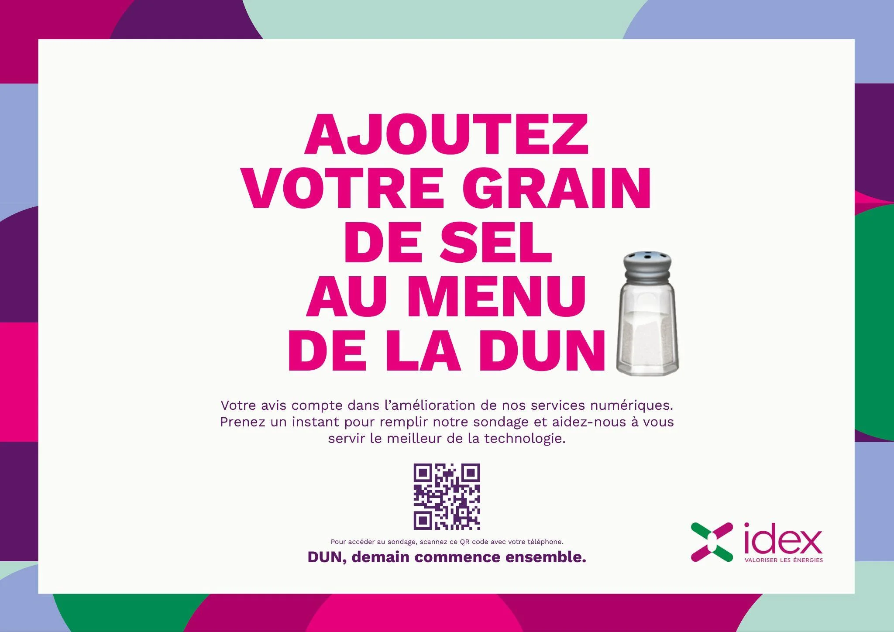
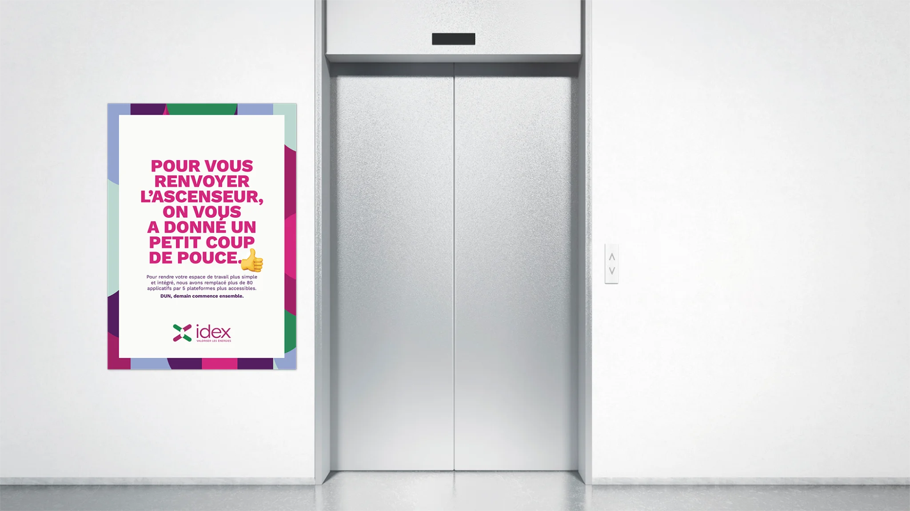
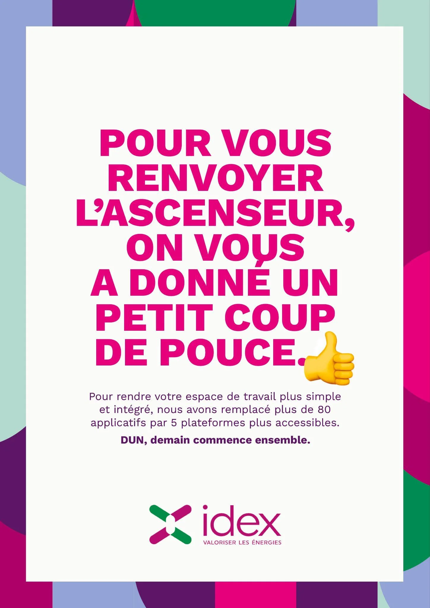

# Idex - Project DUN

| Key | Value |
|-----|-------|
| **Client** | Idex |
| **Year** | 2023 |
| **Topic** | Project DUN |
| **Role** | Creative direction, copywriting, art direction |
| **Tags** | Internal comms, Digital transformation, Guerrilla marketing |
| **Channel** | OXGEN |

## Context

Idex, a French energy efficiency company (6,000+ employees, 200+ sites across France), ran a deep digital transformation through the DUN programme: -30% CO2, 80 legacy apps consolidated into 5 platforms, reinforced cybersecurity. But the field only sees the constraints: tool changes, mandatory training sessions, modified processes. Results are invisible to those who live through them daily. The brief: turn passive resistance into collective pride.

## Approach

Double-meaning wordplay poster series paired with custom 3D emojis: each headline starts negative then flips positive. Art direction: multicolour geometric border, white central card, bold magenta type. Guerrilla deployment on elevator doors, in cafeterias and next to coffee machines. QR code survey "Add your two cents" to collect field feedback and turn the campaign into a two-way dialogue. Unifying tagline: "DUN, tomorrow starts together."

## Deliverables

- "DUN, tomorrow starts together" concept
- Double-meaning wordplay poster series
- Custom 3D emojis and multicolour DA
- Guerrilla: elevator, cafeteria, coffee
- Interactive QR code survey

## Highlight

> You can't convince a technician with a PowerPoint. You convince them with a joke on the coffee machine.

## Visuals

## Related

- [experience/oxgen.md](../experience/oxgen.md)
