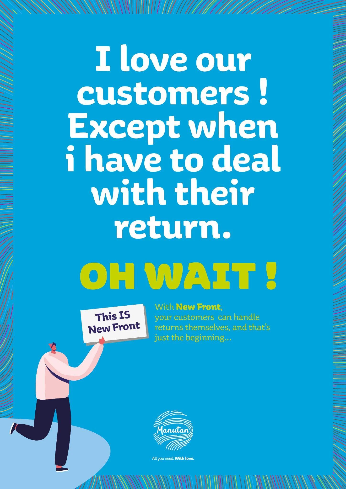
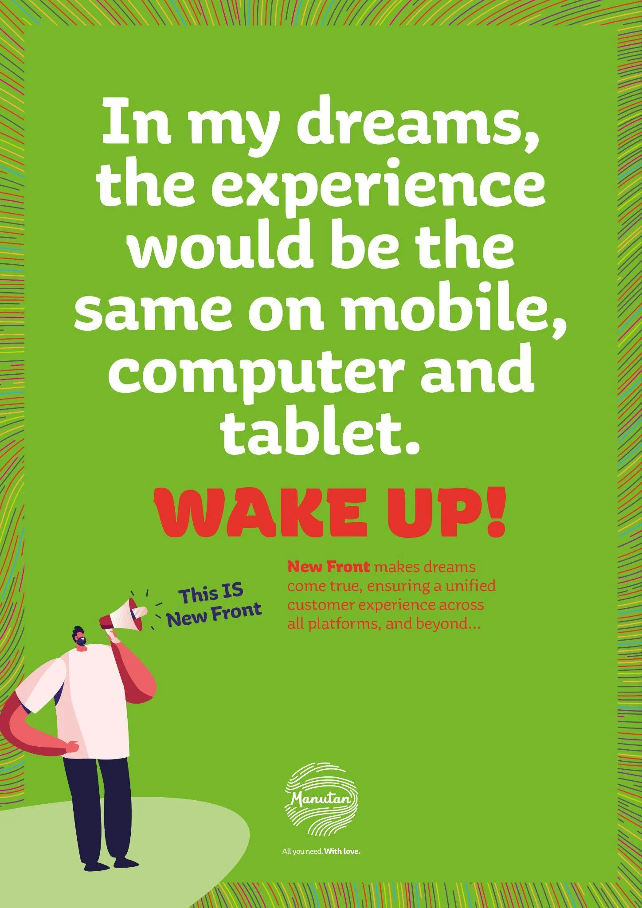
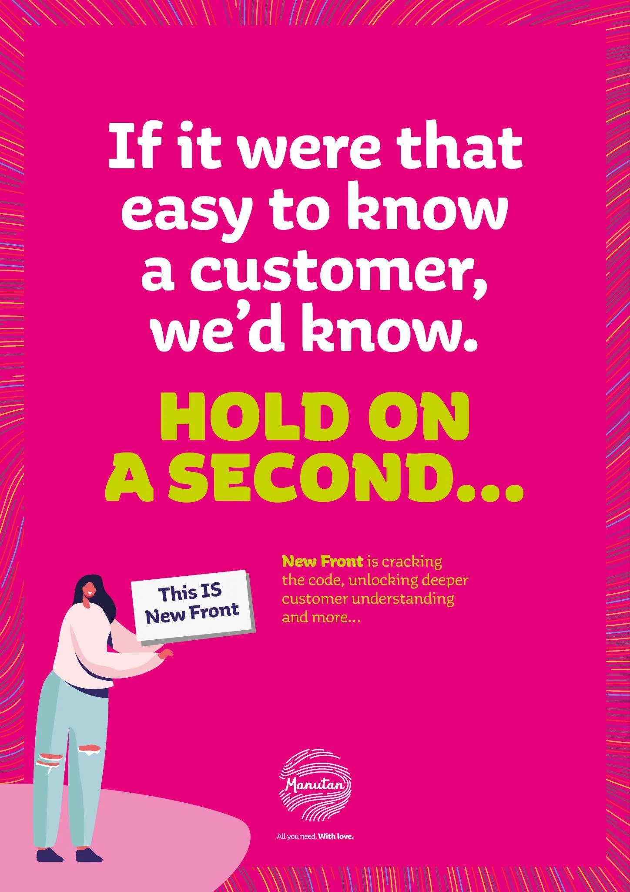
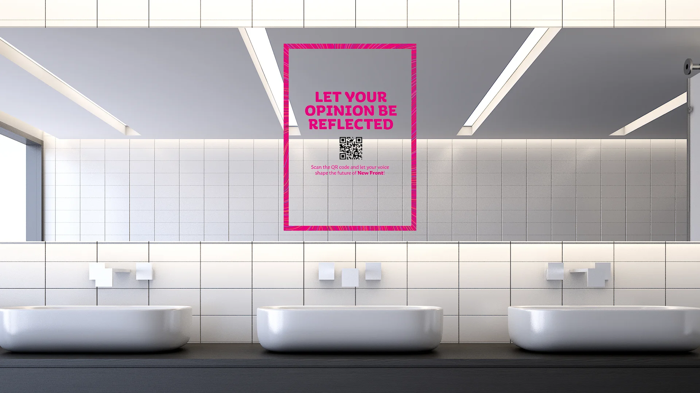

# Manutan - NewFront

| Key | Value |
|-----|-------|
| **Client** | Manutan |
| **Year** | 2024 |
| **Topic** | NewFront (SI transformation) |
| **Role** | Creative direction, copywriting, art direction |
| **Tags** | Internal comms, SI transformation, Change management |
| **Channel** | OXGEN |
| **Reach** | 2,700 employees, 26 countries, native English |

## Context

Manutan, a European B2B distribution leader (2,700 employees, 26 countries), launches NewFront: a 3-to-5-year SI transformation to replace a legacy system built in the early 2000s. Tense context: the CIO just departed, IT teams are understaffed, and business units see the project as "yet another IT overhaul with no end in sight". The brief demands an immediate buy-in moment in native English for an international audience.

## Approach

Each poster starts with a daily business frustration phrased as a confession, then flips the script with an "OH WAIT!" that reveals the NewFront solution. An illustrated character brandishes a placard like a town crier. Each visual has its own bold colour and hatched pattern. Spoken tone, native English. The concept works equally in print and digital across 26 countries, from office walls to internal channels and launch event screens.

## Deliverables

- "OH WAIT!" concept and NewFront identity
- Twist-reveal poster series
- Illustrated town crier characters
- Hatched patterns and bold palette
- Digital adaptations for 26 countries

## Highlight

> The IT department's biggest enemy isn't resistance to change. It's indifference.

## Visuals

## Related

- [experience/oxgen.md](../experience/oxgen.md)
