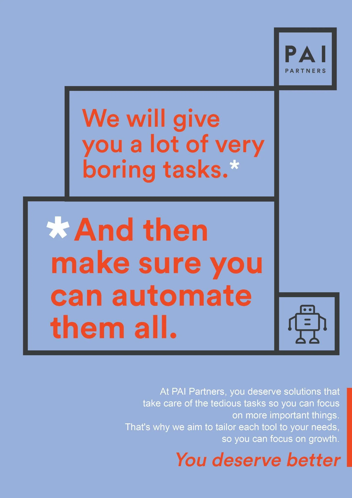
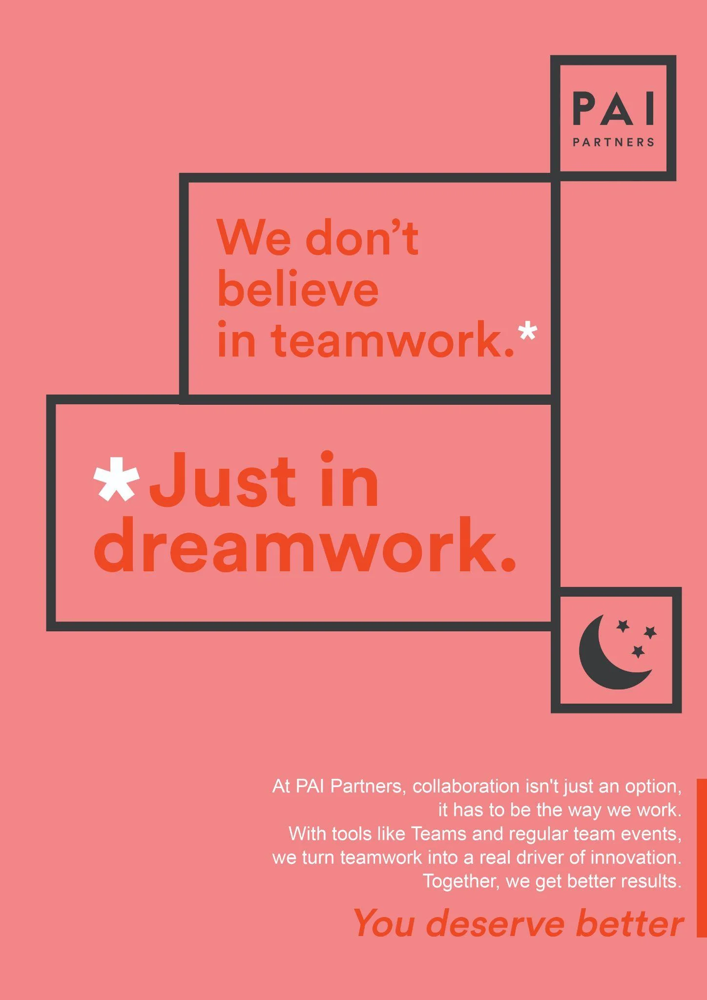
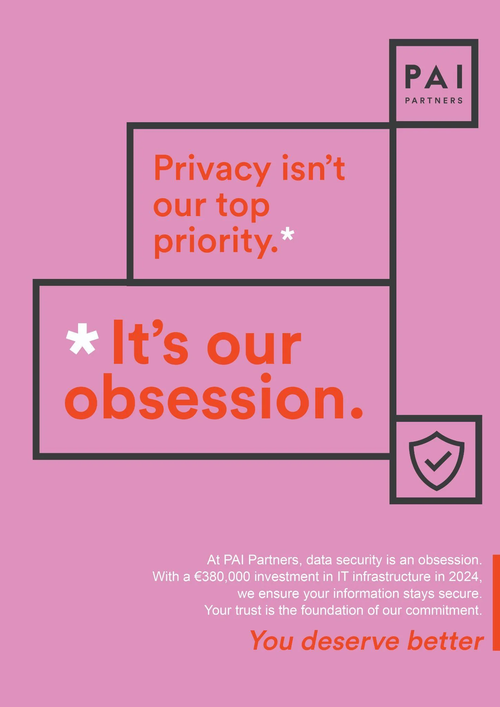
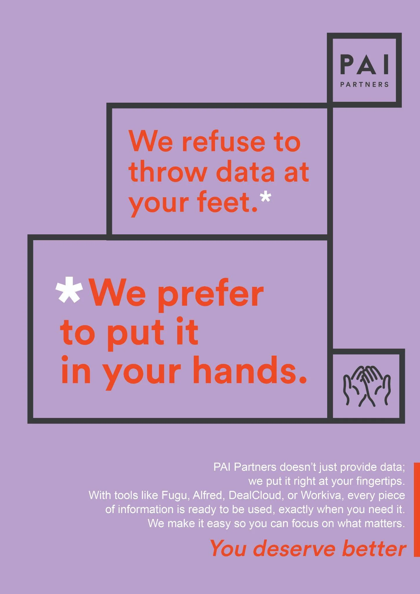

# PAI Partners - You Deserve Better

| Key | Value |
|-----|-------|
| **Client** | PAI Partners |
| **Year** | 2025 |
| **Topic** | You Deserve Better |
| **Role** | Creative direction, copywriting, art direction |
| **Tags** | Internal comms, Digital innovation, Change management |
| **Channel** | OXGEN |

## Context

PAI Partners, a leading global private equity firm (25 billion euros under management), has invested in innovative IT solutions: Fugu, Alfred, DealCloud, Workiva. But the individualistic culture of deal teams slows adoption. Each partner runs their own portfolio, their own way. Digitalisation is seen as an IT constraint rather than a business lever. The challenge: flip this perception in an environment where attention span is close to zero.

## Approach

Contrarian asterisk poster system: each poster opens with a provocation ("We refuse to throw data at your feet*") that the asterisk flips into a concrete promise. Staircase geometric layout inspired by PAI's visual identity, distinct pastel palette per poster, custom line-art icons, italic serif signature. Multi-touchpoint deployment: elevators, coffee machines, screen wallpapers. The tone is unapologetically direct, matching a culture where people skip small talk.

## Deliverables

- "You Deserve Better" asterisk concept
- 5 thematic posters, pastel palette
- Staircase geometric art direction
- Custom line-art icons per theme
- Elevator, coffee, screen deployment

## Highlight

> The asterisk is the most honest punctuation mark. It promises to explain itself.

## Visuals

## Related

- [experience/oxgen.md](../experience/oxgen.md)
