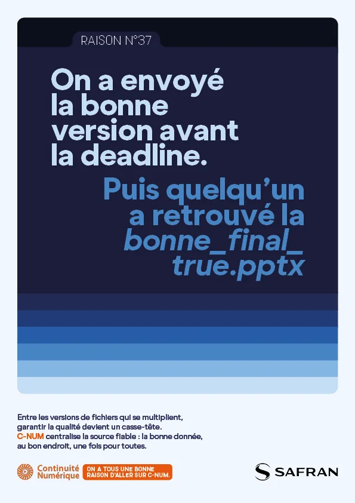
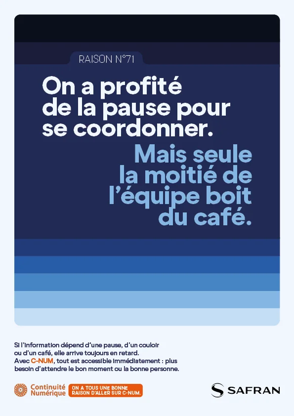
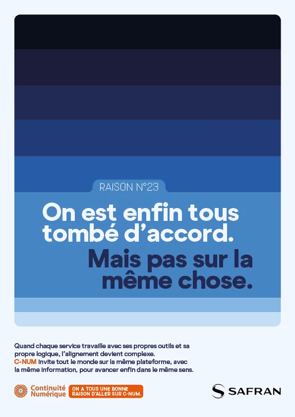
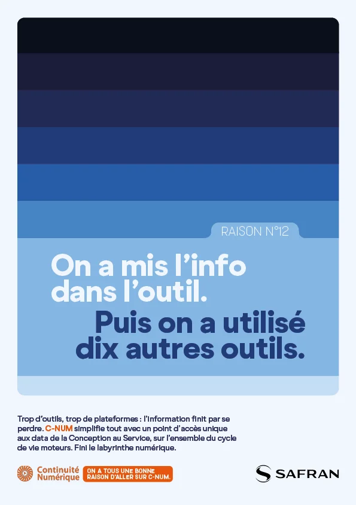
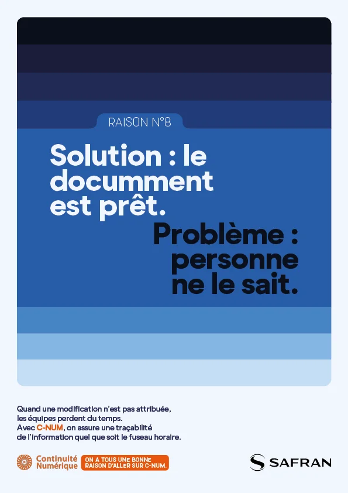
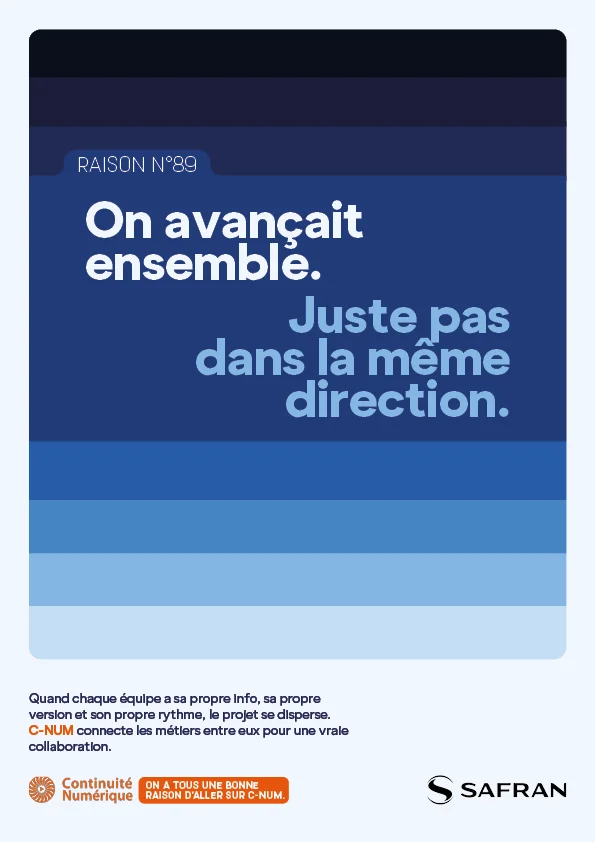

# Safran - C-NUM Platform

| Key | Value |
|-----|-------|
| **Client** | Safran |
| **Year** | 2025 |
| **Topic** | C-NUM Platform |
| **Role** | Creative direction, copywriting, art direction |
| **Tags** | Internal comms, PLM, Digital transformation |
| **Channel** | OXGEN |

## Context

Safran, a global aerospace and defence group (80,000+ employees), is rolling out C-NUM, its shared digital continuity platform built on product lifecycle management (PLM). After 4 years of deployment, teams across engineering, production and support see it as a never-ending IT project with no tangible benefit. The challenge: break through adoption fatigue and make people understand why a PLM tool matters to their daily work.

## Approach

"REASON #..." series with deliberately non-sequential numbering (#23, #37, #71) implying dozens of reasons to adopt C-NUM. Each poster starts with a universal office frustration ("We sent the right version before the deadline. Then someone found the right_final_true.pptx") followed by a concrete explanation. Art direction: horizontal navy-to-blue gradient stripes, bold condensed white type, dual branding Digital Continuity + Safran.

## Deliverables

- "REASON #" concept and campaign system
- Frustration-hook poster series
- Email signatures for ambassadors
- Guerrilla stickers for office spaces
- Digital screen adaptations

## Highlight

> When you can't explain why people should care, numbering the reasons at random is more honest than pretending there's only one.

## Visuals

## Related

- [experience/oxgen.md](../experience/oxgen.md)
