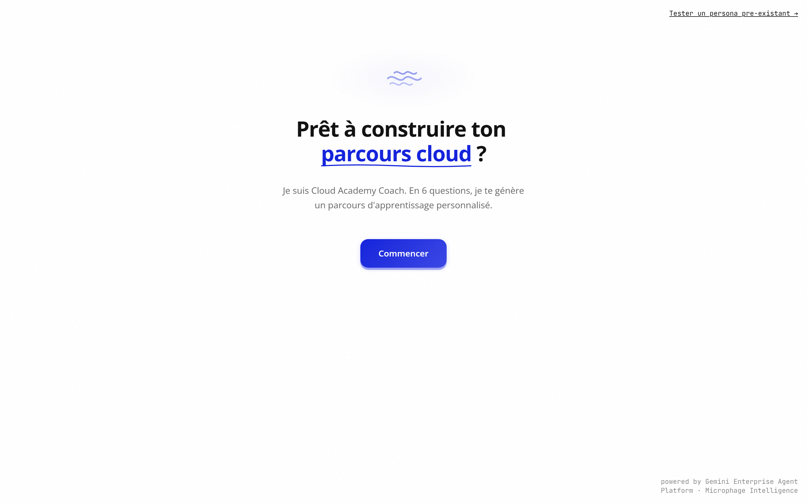
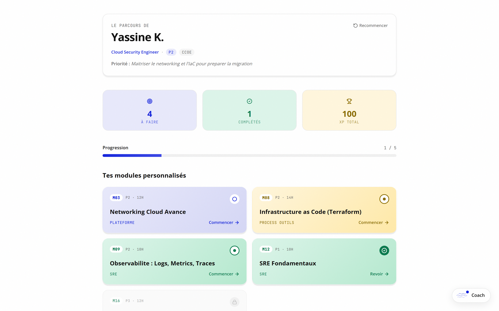
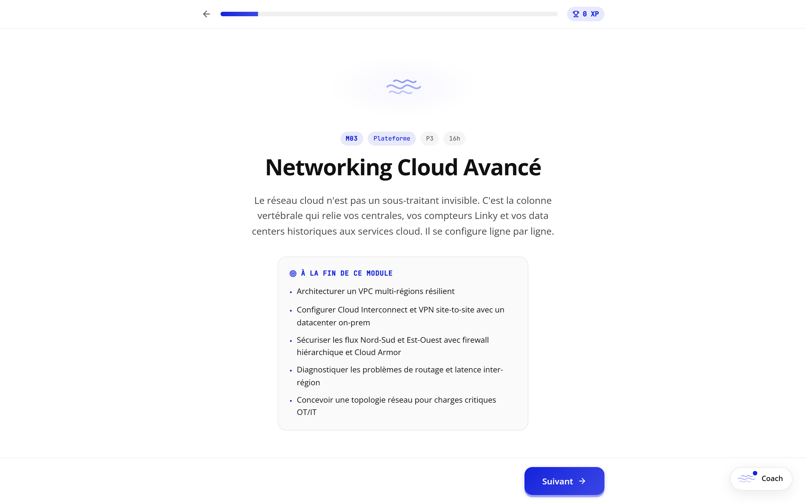
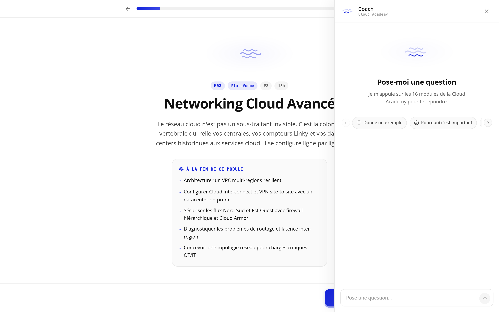
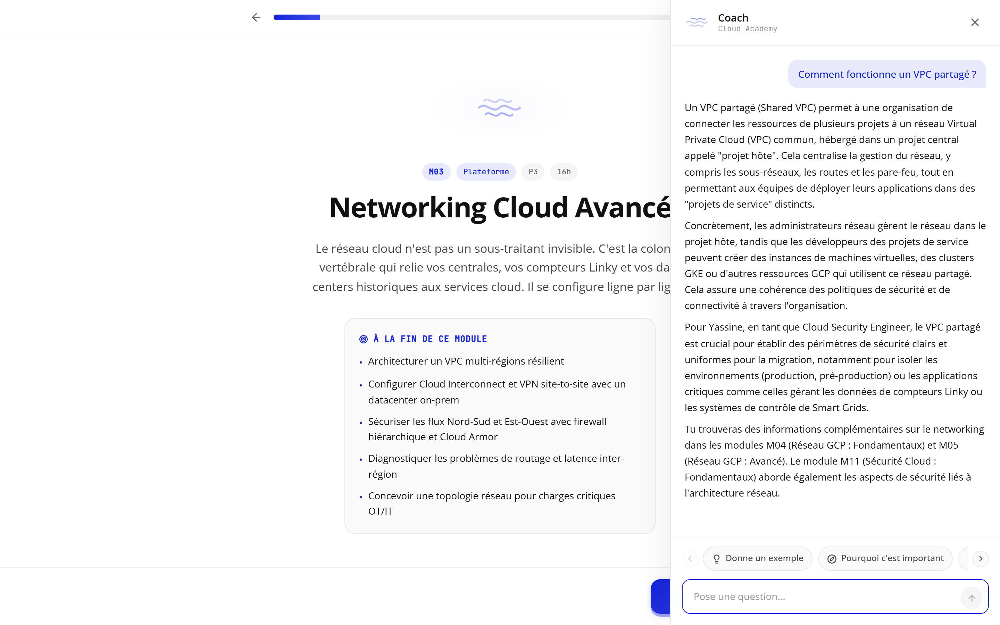

# Cloud Academy Coach

| Clé | Valeur |
|-----|--------|
| **Type** | POC produit IA sur Gemini Enterprise Agent Platform |
| **Statut** | Live, public |
| **Date** | Mai 2026 |
| **Société** | Microphage (SASU) |
| **Industrie cible** | Énergie / Utilities (acteur transition énergétique) |
| **Équipe** | Romain Bigache (solo) |
| **Durée de build** | 1 nuit |

## Pitch court

Une academy interne d'un acteur énergie où un agent IA orchestrateur génère un parcours adaptatif personnalisé et coache l'apprenant en RAG conversationnel sur 16 modules indexés. Stack Gemini Enterprise Agent Platform : Gemini 2.5 Pro + function calling + Vertex AI Search + Cloud Run. Livré en une nuit, déployé public.

## Genèse

Construit en une nuit en mai 2026 pour valider de bout en bout la stack Gemini Enterprise Agent Platform (Vertex AI Search + Cloud Run + function calling Gemini 2.5 Pro) sur un cas d'usage métier réaliste.

Cas d'usage : une academy interne avec une matrice rôles × modules × niveaux qui devient ingérable à mesure que l'effectif et le catalogue grossissent. La promesse : remplacer cette matrice statique par un agent IA qui personnalise le parcours collaborateur en live, contextualise les exemples sur le métier (Smart Grid, compteurs Linky, énergies renouvelables pour la version énergie), et coache l'apprenant en RAG conversationnel.

## Description courte

Webapp Next.js 15 sur Cloud Run europe-west1. Onboarding 8 questions, agent orchestrateur Gemini 2.5 Pro avec 5 tools, datastore Vertex AI Search avec 16 modules pédagogiques indexés, parcours adaptatif gamifié, drawer Coach RAG side-panel, lesson player Duolingo-style.

## Description longue

### Le problème adressé

Dans une grande organisation énergie, le service formation tient à jour une matrice Excel : 15 rôles métier × 16 modules cloud × 3 niveaux de maîtrise. Trois personnes administrent cette matrice, l'enrichissent, l'aiguillent. Mais les collaborateurs ne suivent pas leur parcours assigné : les modules n'arrivent pas dans le bon ordre, les prérequis sont opaques, les exemples restent génériques au lieu d'être contextualisés sur le métier (Smart Grid, Linky, énergies renouvelables).

### La solution livrée

Cinq composants coordonnés :

1. **Onboarding interactif** : 8 questions guidées (prénom, entité, rôle, niveau, modules déjà complétés, priorité 6 mois) qui collectent un profil collaborateur structuré.

2. **Agent orchestrateur Gemini 2.5 Pro** : function calling sur 5 tools custom (`get_role_matrix`, `search_modules`, `check_prerequisites`, `assign_modules`, `book_calendar`). L'agent diagnostique le profil, recherche les modules pertinents, vérifie les prérequis, assigne le parcours et réserve une session pour le premier module. Tous ses tool calls sont visibles en live dans l'UI (asset pitch tech).

3. **Datastore Vertex AI Search** : 16 modules pédagogiques riches (~3000 mots chacun, format HTML), ingérés dans le datastore `cloud-academy-modules`. Disponibles pour le RAG conversationnel avec grounding automatique.

4. **Parcours hub adaptatif** : tableau de bord personnalisé avec les modules recommandés par l'agent, leur statut (à faire / en cours / complété / verrouillé par prérequis), métriques XP, progression globale.

5. **Lesson player Duolingo-style** : intro / sections markdown / quiz / cas pratique / bilan XP. Boutons "Approfondir avec Coach" contextuels qui ouvrent un drawer RAG avec le contexte de la slide.

6. **Drawer Coach RAG** : side-panel persistent 33vw avec chat conversationnel. Streaming NDJSON, sources Vertex Search citées en pills cliquables (« 📚 M16 Disaster Recovery »), contexte profil maintenu entre sessions.

### Architecture technique

```
┌─────────────────────┐
│ Frontend Next.js 15 │ ← Cloud Run europe-west1
│ Tailwind 4 + RSC    │   2 vCPU, 2 Gi, min-instances=1
└──────────┬──────────┘
           │ NDJSON stream
┌──────────▼──────────┐
│ /api/agent          │ ← orchestrateur (5 tools)
│ /api/chat           │ ← RAG conversationnel
└──────────┬──────────┘
           │ @google/genai SDK
┌──────────▼──────────────────────────────┐
│ Vertex AI / Gemini 2.5 Pro (location=global) │
│  ├─ Function calling (5 tools)          │
│  └─ Tool retrieval VertexAISearch       │
│       ↓                                 │
│  Datastore cloud-academy-modules        │
│  16 documents HTML indexés              │
└─────────────────────────────────────────┘
```

Auth via Application Default Credentials du service account Cloud Run (rôles `aiplatform.user` + `discoveryengine.viewer`). Aucune SA key fichier (org policy bloque la création).

### Stack tech

- **Front** : Next.js 15 + React 19 + TypeScript + Tailwind 4 + Open Sans + shadcn-style components custom
- **Streaming** : NDJSON via ReadableStream + watchdog 45s côté client
- **Backend** : routes Next.js API (Node runtime, maxDuration 60s)
- **AI** : @google/genai SDK avec mode `vertexai: true` (Application Default Credentials)
- **Datastore** : Vertex AI Search (`cloud-academy-modules_1777599701196`), 16 docs HTML
- **Deploy** : Dockerfile multi-stage Node 20 Alpine, Cloud Build, Artifact Registry
- **Region** : europe-west1 (proche client énergie)

## Captures

### 1. Onboarding



Pattern Altaria-like : titre WordReveal mot par mot avec accent souligné, mascotte Breath bleu Enedis #1423DC, bouton primary 3D Duolingo-style avec ombre dure rétractable au click. Signature stack en mono fixed-bottom (« powered by Gemini Enterprise Agent Platform / Microphage Intelligence »).

### 2. Parcours hub



6 modules personnalisés affichés en cards avec gradient pillar (Plateforme / Process Outils / SRE), métriques XP, progression globale. Chaque card a un état (en cours / complété / verrouillé par prérequis) que l'agent a calculé. Le parcours s'adapte aux modules déjà complétés du profil.

### 3. Lesson player



Pattern Duolingo : intro de module avec pill ID + niveau + durée, objectifs en bullets bleu Enedis, bouton primary pour démarrer. Slides séquentielles ensuite : sections markdown / quiz / cas pratique / bilan XP gagné.

### 4. Drawer Coach (état initial)



Side-panel 33vw fixed-right, animation slide-in 350ms cubic-bezier soft. Pas de backdrop sur desktop (le contenu lesson reste actionnable à gauche). 4 quick replies premium avec icônes Lucide (no emoji) en bas du panel.

### 5. Drawer Coach avec grounding RAG



Question utilisateur : « Comment fonctionne un VPC partagé ? ». L'agent Gemini répond en streaming, contextualise la réponse pour Yassine (Cloud Security Engineer) avec exemples métier énergie (Smart Grid, compteurs Linky), et cite explicitement les modules M03 Networking Cloud Avancé et M11 Sécurité Cloud comme sources. Les sources apparaissent en pills cliquables qui routent vers `/modules/MXX`.

## Choix techniques notables

### Auth Vertex AI sans clé SA (org policy compliant)

L'environnement GCP cible bloque `iam.disableServiceAccountKeyCreation` (org policy classique en grand compte). Auth via Application Default Credentials du service account Cloud Run par défaut, avec rôles `aiplatform.user` + `discoveryengine.viewer` bindés au niveau projet. Pattern compatible avec les contraintes de sécurité grand compte.

### Override d'org policy pour exposition publique

Org policy `iam.allowedPolicyMemberDomains` empêche par défaut le binding `allUsers : roles/run.invoker`. Override appliqué au niveau projet via `gcloud org-policies set-policy`, après self-grant du rôle `orgpolicy.policyAdmin` au niveau organisation. Pattern utile pour les démo publiques sur des projets soumis aux org policies enterprise par défaut.

### Build Docker custom plutôt que Buildpacks

Buildpacks via `gcloud run deploy --source` ne donne pas de log clair en cas d'échec. Pour gagner en visibilité et en contrôle (multi-stage Node 20 Alpine, gestion explicite des artefacts copiés), build via `gcloud builds submit --tag` puis `gcloud run deploy --image`. Logs streamés en live, fix immédiat.

### Streaming NDJSON avec watchdog client

Ligne directrice : si l'API ne stream rien dans les 45 secondes, le frontend abort la requête avec message friendly plutôt que de bloquer indéfiniment. Cold start Cloud Run éliminé via `--min-instances=1`, latence Vertex AI réduite via `GOOGLE_CLOUD_LOCATION=global` (auto-routing region la plus proche).

### Ingestion datastore via HTML

Vertex AI Search refuse l'ingestion de fichiers `.md`. Pipeline de conversion `.md` → `.html` automatisé en amont (script Python dédié), ré-indexation atomique. Idem possible pour PDF, Word, etc. selon le format source du client.

## Ce que ça démontre

- **Agent orchestrateur Gemini avec function calling production-grade** (5 tools, gestion des prerequis, history multi-turn, system prompt riche, function declarations strictement typées)
- **RAG conversationnel sur Vertex AI Search** avec grounding automatique et citation des sources
- **Streaming NDJSON propre** end-to-end (Cloud Run → Next.js stream → React state)
- **Stack 100% GCP** : Vertex AI, Cloud Run, Cloud Build, Artifact Registry, Vertex AI Search, IAM, Org Policy
- **Capacité de delivery solo** : 16 modules pédagogiques riches générés par sub-agents en parallèle, agent + UI livrés en une nuit, pitch comex 1-pager exporté en PDF, déploiement public résistant aux org policies restrictives
- **Design system Altaria-like cohérent** : pas d'emoji, icônes Lucide stroke 2.2, accent bleu Enedis #1423DC parcimonieux, ombres soft, animations cubic-bezier 200-350ms

## Roadmap production

Les choix POC suivants évoluent naturellement en passage prod chez un client :

- **Persistence** : `localStorage` côté client → Firestore ou Cloud SQL côté serveur (sessions multi-devices, historique apprenant)
- **Auth applicative** : `--allow-unauthenticated` → IAP + IAM + sessions Firestore avec liaison annuaire client (LDAP / Workspace)
- **Catalogue modules** : 16 modules synthétiques de démo → ingestion du catalogue formation réel client (pipeline d'extraction + normalisation depuis LMS, SharePoint, Confluence, etc.)
- **Tests + CI/CD** : pattern déjà éprouvé sur Microphage Analyzer Pro en prod (102 tests Vitest + Playwright, déploiement Cloudflare Workers automatisé) à transposer sur la stack GCP cible
- **Observabilité** : Cloud Operations Logging + Cloud Trace + dashboard Looker Studio pour KPI métier (time-to-competence par profil, taux de complétion, détection des décrochages, charge cognitive)

## Liens

- **Démo live** : [https://cloud-academy-ui-90119460065.europe-west1.run.app](https://cloud-academy-ui-90119460065.europe-west1.run.app)
- **1-pager comex (PDF)** : sur demande
- **Code source** : sur demande (repo privé Microphage)

## Related

- [microphage](../experience/microphage.md)
- [expertise](../expertise.md)
- [stack](../stack.md)
- [methodology](../methodology.md)
