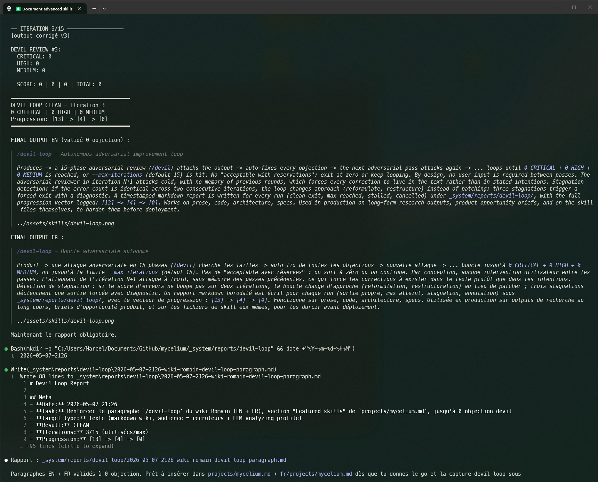
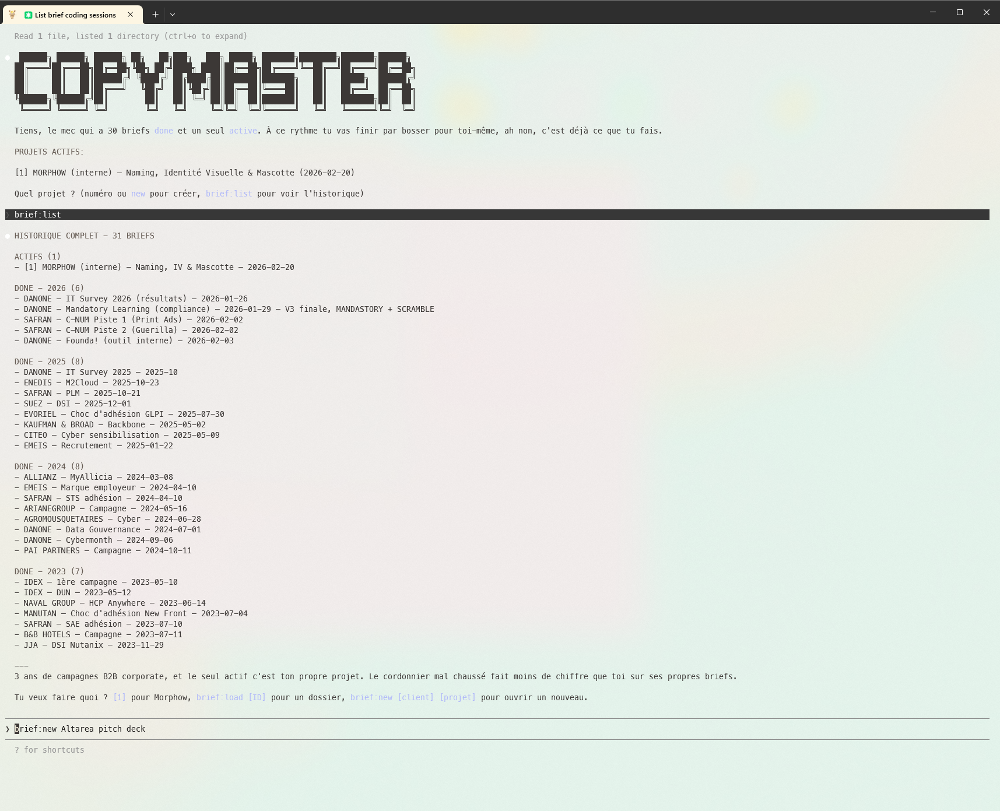
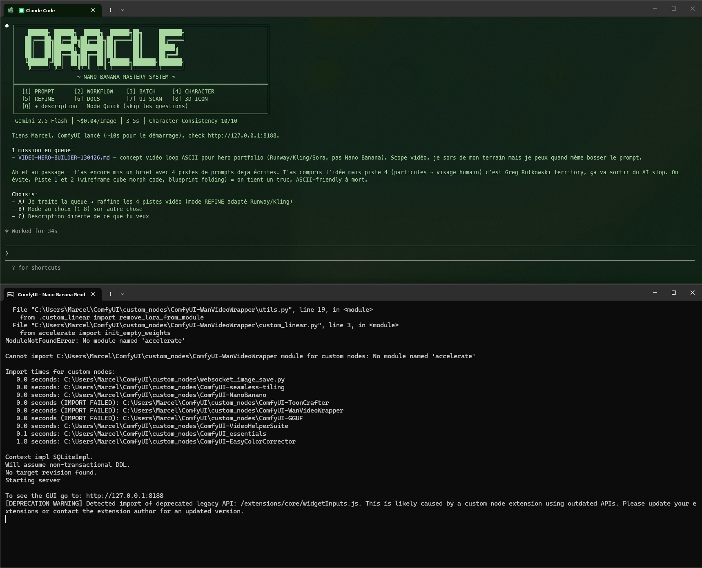

# Mycelium

| Key | Value |
|-----|-------|
| **Type** | Internal Claude Code tooling (custom skills, subagents, hooks, memory) |
| **Status** | Internal production, ~30 active skills |
| **Year** | 2026 - ongoing |
| **Visibility** | Private repo (strategic asset) |
| **Team** | Romain Bigache (solo) |

## Short title

Internal Claude Code tooling stack to orchestrate solo multi-project work.

## Short description

Mycelium is the internal infrastructure that industrializes Marcel's solo work across all Microphage projects: ~30 domain-specific Claude Code skills, specialized subagents, session hooks, structured persistent memory. Lets the delivery pace hold (POC in 3 weeks) by automating cognitive boilerplate and wiring each skill to the right external APIs (Legifrance, Judilibre, Figma, GitHub, Stripe, etc.).

## Architecture

Mycelium applies the LLM Wiki pattern to internal tooling: single source of truth, lazy loading, atomic files per skill, conventioned frontmatter, cross-links between skills.

Methodology details: [methodology.md](../methodology.md).

### Skill families

#### Creative (4 skills)

- **`/copywriter`**: corporate writing, hooks, headlines, tone/audience adaptation, multi-language. Knowledge base of briefs and templates per client.
- **`/da`**: art direction, moodboards, art direction boards, visual identity.
- **`/prompt-oracle`**: AI image prompts (Gemini, DALL-E), visual styles, `.ico` and `.png` generation in a ComfyUI pipeline.
- **`/plannermaster`**: communication strategy, campaign plans, decks, market analyses.

#### Dev (8 skills)

- **`/portal`**: portal dev with Next.js + shadcn/ui + Turborepo. Drives squads via inter-skill queue.
- **`/portal-alpha`**: Factory Pipeline (json-render + Zod, AI app generation).
- **`/portal2`**: portal v2 (Next.js 16 + MUI v6 + Framer Motion + Supabase).
- **`/api`**: API dev with Hono + Zod + Supabase + Upstash Redis.
- **`/figma`**: B2C consumer Figma plugins (Extractor + Analyzer, TypeScript + esbuild).
- **`/figma-pro`**: B2B multi-tenant Analyzer Pro (pnpm + Turbo 2 + Hono Edge + Vitest + Playwright).
- **`/darwin-figma`**: iterative audit and optimization of Figma plugins across 8 dimensions.
- **`/nextjs`**: generic Next.js dev (init, pages, components, forms, API, DB, auth, SEO, tests, deploy, perf).

#### Ops (7 skills)

- **`/ops`**: DevToolsOps. Health checks, infra fixes, repo backups, secrets/junk/stale scans, desktop CLI tool crafting, tech watch (star-history tracking on the toolbox).
- **`/tri`**: file sorting, naming, cleanup. `dry` mode for scan-only without execution.
- **`/env-creator`**: secured `.env` generation, project secrets management.
- **`/team`**: orchestration of W1-W8 workers, parallel tasks with subagents.
- **`/audit`**: reliability audit, vulnerability detection, code review.
- **`/lint`**: linting of a markdown knowledge base (frontmatter, wikilinks, staleness, score /10).
- **`/capture`**: multi-viewport screenshots via Playwright (sites + localhost), dark/light, for book and portfolio.

#### Business (3 skills)

- **`/juriste`**: contract analysis, GDPR / T&Cs compliance, legal writing. **Wired to the Legifrance and Judilibre APIs** for official law and case law search. Knowledge base of analyses and contract templates.
- **`/devis`**: service quoting (dev, UX audit, e-learning, art direction, copy, AI), market grids, proposal generation.
- **`/carriere`**: resume, cover letters, professional emails, evolution tracking, skills assessment.

#### System (8 skills)

- **`/wiki`**: V4 wiki engine (785 rules, 17 categories, AN013 envelope). Modes: `lookup`, `stats`, `audit` (vision capture), `rewrite`, `corpus` (mining plugin-coach JSONs), `improve` (proposes rule changes), `diff` (backend vs LLM), `list`. Strict P0 lazy load.
- **`/save`** / **`/resume`**: session save with YAML frontmatter + resume by tags/skill.
- **`/auto-learn`**: capture session learnings into persistent memory.
- **`/review-weekly`**: weekly ritual (scan queues, save points, plans, memory, stale detection, 1-screen dashboard + actions).
- **`/mega-research`**: parallel research with 8 workers (subagents).
- **`/devil`**: adversarial attack, plan / code destruction, internal red team. Stress-tests architectures before delivery.
- **`/devil-loop`**: autonomous adversarial loop (devil running continuously).

#### Personal (2 skills)

- **`/modder`**: game modding (analyze engine, create mods, patch files, extract assets, personal wiki).
- **`/poe`**: Pillars of Eternity 1+2 build oracle (meta builds, theorycrafting, synergies).

### Featured skills

A handful of skills are deeply tooled, not just thin slash-command wrappers. Three of the most refined:

#### `/devil-loop` - Autonomous adversarial improvement loop

Produces -> a 15-phase adversarial review (`/devil`) attacks the output -> auto-fixes every objection -> the next adversarial pass attacks again -> ... loops until `0 CRITICAL + 0 HIGH + 0 MEDIUM` is reached, or `--max-iterations` (default 15) is hit. No "acceptable with reservations": exit at zero or keep looping. By design, no user input is required between passes. The adversarial reviewer in iteration N+1 attacks cold, with no memory of previous rounds, which forces every correction to live in the text rather than in stated intentions. Stagnation detection: if the error count is identical across two consecutive iterations, the loop changes approach (reformulate, restructure) instead of patching; three stagnations trigger a forced exit with a diagnostic. A timestamped markdown report is written for every run (clean exit, max reached, stalled, cancelled) under `_system/reports/devil-loop/`, with the full progression vector logged: `[13] -> [4] -> [0]`. Works on prose, code, architecture, specs. Used in production on long-form research outputs, product opportunity briefs, and on the skill files themselves, to harden them before deployment.

#### `/copywriter` - Multi-mode copy machine with lazy-loaded knowledge base

Five modes: creative (slogans, wordplay, social, campaigns, roast); brief (analysis, creation); web (landing, UX writing, email, CTA, pricing); visuals (bridge to `/prompt-oracle`); portal (chat-driven edits from the portal app). Knowledge base of 24 specialized files, lazy-loaded via a routing table that caps at 3 files per task to keep the context budget under control. Per-client `BRIEFS-INDEX.yaml` with `status: active | done` filtering, so the startup picker only shows live work. Forced workflow: analysis -> two or three concept directions -> user validates -> only then production. Thirteen hard principles distilled from production sessions (clarity beats clever, no ambiguous pronouns, specificity beats generality, no claim without proof). Native MCP Canva export (PRO with crop marks plus REGULAR), naming convention enforced (`[CLIENT]_[BRIEF]_[TYPE]_[DDMMYY]_v[N].[ext]`), Prez Engine for standalone HTML decks from a single YAML brief. Portal mode emits `EDIT: slideId/elementEl` blocks that the portal renders as Apply / Reject diff cards, so a copy revision can ship from a phone.

#### `/prompt-oracle` - Image prompt and ComfyUI orchestrator (Gemini 2.5 Flash)

Eight specialized modes accessible from a header menu: PROMPT (single Gemini-optimized prompt), WORKFLOW (full ComfyUI workflow JSON), BATCH (variation series), CHARACTER (multi-pose character sheet with consistent identity), REFINE (existing prompt improved via Devil Loop), DOCS (documentation lookup), UI SCAN (analyzes a UI screenshot and proposes illustrations, icons, empty states), 3D ICON (clay or glossy 3D icons with transparent background). Bridges ComfyUI: writes the prompts, can launch the local server, then `/copywriter fetch` round-trips the generated images back into the right client deliverable folder. Cost and latency targets surfaced in the header: Gemini 2.5 Flash, ~$0.04 per image, 3-5 second turnaround. Reference-driven by design: vague briefs ("a nice professional image") get pushed back with a request for a specific visual reference instead of being honored. Generated images are auto-routed to the matching client/project folder, so output lands directly where the deliverable is being assembled.

### Specialized subagents

- **`Explore`**: fast codebase exploration agent (find files, search, codebase QA).
- **`Plan`**: software architect for step-by-step implementation designs.
- **`general-purpose`**: multi-step research and complex tasks.
- **`code-reviewer`**: second opinion on PRs, code audits.
- **Skill subagents**: darwin-skill, huashu-nuwa, shadcn-ui (skills wrapped as agents).

### Hooks and conventions

- **Session start**: check inter-skill queues, load context, activate skills based on arguments.
- **Registry update**: maintains a global index of available skills.
- **File protection**: forbids any modification of `.claude/` without confirmation.
- **Anti-duplication**: existence check before file creation.
- **Skill convention**: mandatory markdown template (META, STARTUP, RULES, WORKFLOW).

### Persistent memory

- `MEMORY.md`: main index, automatically loaded into context
- `memory/*.md`: atomic memories per topic (user, feedback, project, reference)
- Write-on-learn cycle: every user correction, architecture decision, or feedback is saved to memory for future sessions

## Why it's differentiating

Designer + dev + content + ops profile, all orchestrated by a custom Claude Code stack. Compresses the delivery cycle (POC in 3 weeks) by automating the cognitive boilerplate of each domain.

## Visibility

Private repo (internal strategic asset). Live demo walkthrough available under NDA.

## Related

- [methodology.md](../methodology.md)
- [process.md](../process.md)
- [experience/microphage.md](../experience/microphage.md)
- [stack.md](../stack.md)
