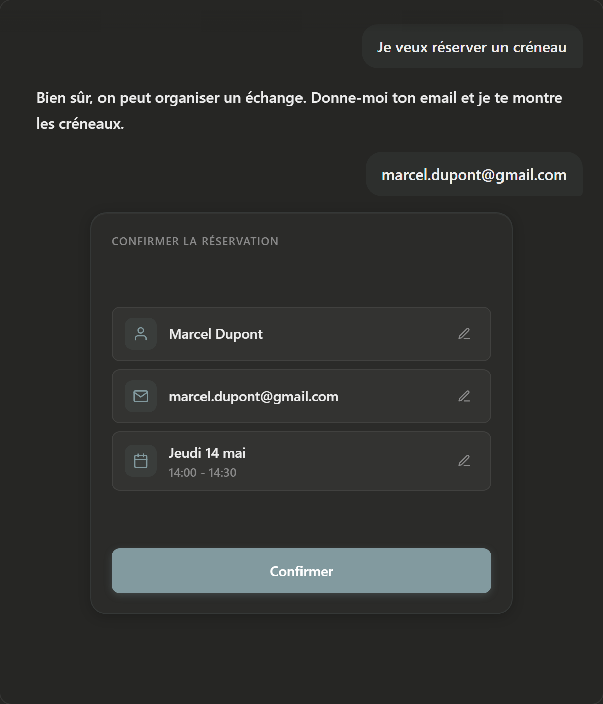
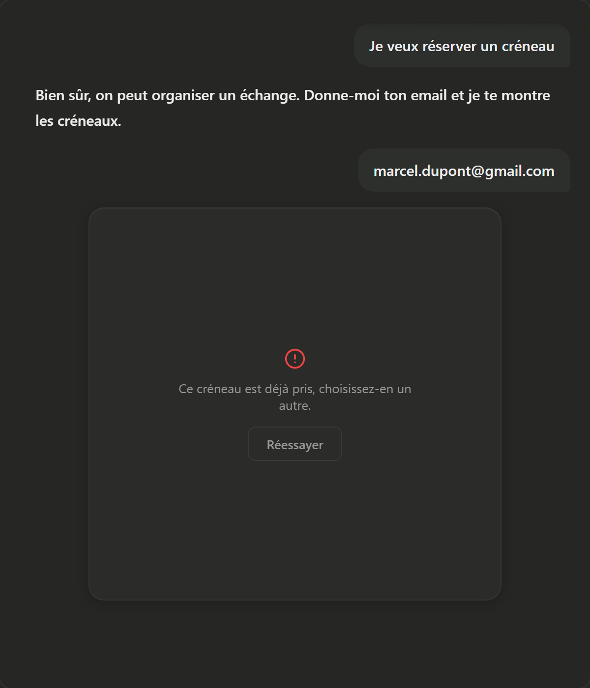

# Everyone knows how to code. Nobody polishes.

Something has been bothering me for a few months: interfaces are getting less and less polished. Institutional sites, startups that just raised 50 million, indie hackers. The CTA button isn't centered. The label floats above the middle. The hover state pops into the void. You get the feeling no one stops to look at what's right in front of them anymore.

Everyone knows how to code now, and nobody polishes. That's the real disease.

So when people ask me how I ship interfaces that hold up, I don't give them a magic method. I just give what works for me right now: a static HTML file before opening a single React file.

## What I put down this week

I wanted to redo the booking widget on my site. A list of time slots in the chat, click on the time, confirm. Instead of opening my Next.js repo and diving into TSX, I opened a blank HTML file.

I laid down 9 states side by side on the same page: skeleton during the LLM tool call, calendar with scarcity, list of time slots, recap, inline email edit, "in progress" state, confirmation, 409 error when the slot gets taken elsewhere at the same time, and the case where the LLM has to ask for a first name because the email is opaque.

2 hours. All states visible at the same time, full screen, in dark and light, in French and English. Before a single line of React.

## Why not go straight to code

The point isn't that it saves time. If I'd coded it directly, I'd have finished faster. But it would have been worse.

In code, you never see all your states together. You see the happy path in dev, you trigger the error manually, you watch the loading state for two seconds before it disappears. You don't polish a state you see for two seconds. You polish a state that's been in front of you for 2 hours.

The other reason is that it's just logical. You build the front before the back. The HTML mockup is your front without the back: no API to wire up, no state to manage, no provider to wrap. Just the rendering. You iterate 15 times in an hour because there's nothing else to break. Once the front is locked, the back becomes a clean execution behind a UI already drawn.

And nobody looks at their code anymore anyway. We look at the rendering on localhost. The HTML mockup gives you that rendering faster, without the cost of having everything wired up.

And above all, you see what's missing. By laying out the sequence "click on the time → POST booking", I saw something was missing in between. The user has no moment to re-read what they're about to confirm. Name, email, date, time. I added a recap with an inline edit pencil on each field. What's called a poka-yoke in lean: a foolproofing device. Not much in terms of code. A real saving in error rate.

I probably wouldn't have thought of that recap if I'd coded directly. I'd have wired the booking API to the slot click, seen it worked, closed the ticket. It's by looking at the mockup, by laying out the states side by side, that the gap appears. The HTML mockup shows you the questions you hadn't seen.

Same for the copy. Next to the success state, you see that "this slot was just taken" sounds accusatory. You correct it to "this slot is already taken", neutral. One word changes, but you make the change because you have both versions in front of you. In code, you'd have read that copy in a strings file, not in its context.

## And every component you keep

The simple thing is that polishing the mockup forces you to focus on each component. Not in passing, not skimming. Really. And every component deserves that attention.

A well-made component is a component you reuse. You move it to the next project, you move it three projects later. The second time, it's free. The clean mockup isn't a one-shot cost, it's an investment.

And above all, it's something you stay proud of for a long time. Not the component you shipped in a day because it was urgent and that you redo six months later because you're embarrassed. The one you can leave as-is for two years.

It's like buying a pair of shoes for 60 euros or for 500 euros. The 60-euro pair, you replace every 6 months and toss them out along the way. The 500-euro pair, you keep for five years, you have them resoled once at the cobbler, and they look better at the end than at the start.

## When I open the TSX

When I move to code, I don't decide anything anymore. I copy-paste decisions already made.

The recap with the pencils is set. The copy is locked. The stagger timing? 18ms between each calendar cell, written in the mockup. The glow during the POST? .08 alpha on the accent, in the mockup CSS. Code becomes the execution of a visual plan already written. No more "the button isn't aligned, let me try something else". No more re-design in the middle of a commit.

## Not a method

I don't know if it's a method. For simple cases, I code direct. For a widget with 9 states and animations, the HTML mockup keeps me from shipping careless work.

What reassures me is that polishing isn't learned in 2 hours of mockup. The mockup is just a ground where polishing becomes possible. If you don't have the eye, you won't have it on HTML either. But if you have the eye and you code direct, you don't polish, because you don't have the time.

> Everyone knows how to code. Nobody polishes. Probably the rarest thing in 2026.

So that's my thing right now. 2 hours of static HTML to not ship careless. Not much. Just enough.

## Related

- [writing.md](../writing.md)
- [process.md](../process.md)
